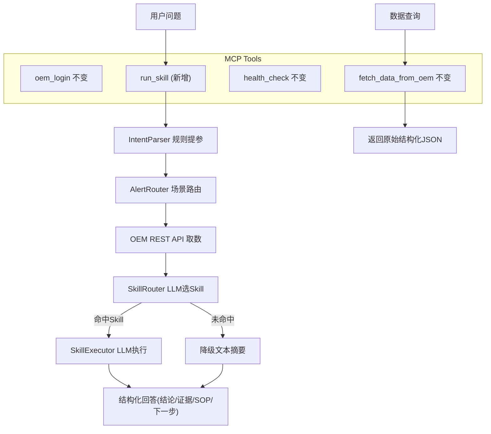

# AI-Powered Skill Engine Refactoring

## MCP 层约束（强制）

- `oem_login`、`fetch_data_from_oem`、`health_check` 三个 MCP tool 的函数签名、入参、返回值、行为不改动
- `mcp_server_http.py` 不变
- **删除 `ask_ops` 工具**：该工具是旧兼容入口，本次改造移除
- **新增 `run_skill` MCP tool**：AI 诊断的统一入口，内部调用 fetch_data + AI Skill Engine

## 改造后端到端完整流程

以 `host01 最近 CPU 高告警怎么处理` 为例：

```
步骤1  用户提问
       Cline / CLI 发送自然语言问题

步骤2  MCP Tool: run_skill 接收 question + session_id
       （新增 MCP tool，AI 诊断统一入口）

步骤3  内部调用 service.fetch_data() —— 数据层（不变）
       3a. IntentParser（规则）: 提取 target_name=host01, time_range=24h, intent=单目标诊断
       3b. AlertRouter（规则优先 + LLM fallback）: 识别场景 scenario=cpu_high
       3c. OEM REST API（只读）: 拉取 incidents / events / latestData / timeSeries

步骤4  调用 AI Skill Engine —— 智能层（本次新增）
       4a. SkillRegistry: 已预加载所有 skills/*/SKILL.md 的元信息（name/description/triggers）
       4b. SkillRouter（LLM）: 将问题 + 全部 Skill 摘要发给 DeepSeek，返回 "cpu-alert-diagnosis"
       4c. SkillExecutor（LLM）: 将完整 SKILL.md 作为 system prompt
                                + OEM 数据（incidents/events/metrics）作为 context
                                + 用户原始问题
                                发给 DeepSeek，LLM 按 SKILL.md 的 Workflow/Constraints 生成回答

步骤5  返回结构化诊断
       固定 4 段格式：结论 / 证据 / SOP建议 / 下一步

步骤6  降级兼容
       若 DEEPSEEK_API_KEY 未配置或 LLM 调用失败，回退到简单文本摘要
```

两条独立路径对比：

- **数据路径**: `fetch_data_from_oem` -> 返回原始结构化 JSON（不变，供 Cline 自行分析或展示）
- **AI 诊断路径**: `run_skill` -> 内部 fetch_data + AI Skill Engine -> 返回 LLM 生成的诊断文本

## 现状问题分析

当前代码中没有真正使用 AI 能力的环节：

- **Skill 选择** (`service.py:_select_skill_for_fetch_result`): 硬编码 `if scenario == "cpu_high"` —— 新增场景必须改代码
- **Skill 执行** (`skill_engine.py:render_cpu_alert_skill`): Python `str.format()` 填模板 —— 无法根据真实 OEM 数据做推理判断
- **SOP 引擎** (`sop_engine.py`): 静态文字模板 —— 每个场景都是固定话术，不能根据证据动态调整
- **回答组装** (`answer_composer.py`): 字符串拼接 —— 结论永远是"已完成XX流程"，不是真正的诊断
- **知识库** (`knowledge_base.py`): 关键词匹配 —— 无语义理解
- **SKILL.md 格式**: 缺少 YAML frontmatter，无法被引擎自动发现和路由

参考 [agent_skills_engine_langchain.py](docs/agent_skills_engine_langchain.py) 的架构：`SkillRegistry` -> `SkillRouter`(LLM) -> `SkillExecutor`(LLM)，整个 Skill 调用链由大模型驱动。

## 改造后目标架构



- `fetch_data_from_oem`: 纯数据工具，签名/返回值不变
- `run_skill`: 新增 AI 诊断入口，内部调用 fetch_data + AI Skill Engine
- `ask_ops`: 删除

## 改造范围

### 1. 新增依赖与环境配置

**文件**: [requirements.txt](requirements.txt)

新增：

```
langchain-openai>=0.3.0
langchain-core>=0.3.0
python-dotenv>=1.0.0
```

**新建文件**: `.env.example`

```
DEEPSEEK_API_KEY=sk-xxx
DEEPSEEK_BASE_URL=https://api.deepseek.com
DEEPSEEK_MODEL=deepseek-chat
```

运行时通过 `load_dotenv()` 从项目根目录 `.env` 加载，与参考文件 `agent_skills_engine_langchain.py` 保持一致。

### 2. 重写 SKILL.md —— 增加 YAML frontmatter 和结构化章节

**文件**: [skills/cpu_alert_mvp/SKILL.md](skills/cpu_alert_mvp/SKILL.md)

参照 [SKILL_example.md](docs/SKILL_example.md) 的标准格式，增加：

- YAML frontmatter: `name`, `description`, `triggers`, `non_triggers`, `version`, `paradigm`
- 正文章节: Goal, Decision Tree, Workflow, Constraints, Resources, Validation

改造后 SKILL.md 既是引擎自动发现/路由的元数据来源，也是 LLM 执行时的完整 System Prompt。

### 3. 重写 skill_engine.py —— 核心改造

**文件**: [src/skill_engine.py](src/skill_engine.py)

当前 61 行的模板渲染器，改造为三个类 + 一个对外入口函数：

- **SkillRegistry**: 扫描 `skills/` 目录，解析每个 SKILL.md 的 YAML frontmatter，缓存 name/description/triggers 元信息。参照 `agent_skills_engine_langchain.py` 的 `SkillRegistry` 类。
- **SkillRouter**: 使用 LangChain `ChatOpenAI` + LCEL chain，将所有 Skill 摘要 + 用户问题发给 LLM，返回最匹配的 Skill 名称。参照 `agent_skills_engine_langchain.py` 的 `SkillRouter` 类。
- **SkillExecutor**: 使用 LangChain LCEL chain，将完整 SKILL.md 作为 system prompt + OEM 结构化数据作为 context + 用户问题发给 LLM，LLM 按 SKILL.md 中的 Workflow 和 Constraints 生成结构化回答。参照 `agent_skills_engine_langchain.py` 的 `SkillExecutor` 类。
- **对外入口函数** `run_skill_with_llm(question, fetched_data)`: 封装 Registry -> Router -> Executor 完整流程，供 `service.py` 调用。

LLM 配置从 `.env` 加载：

```python
from dotenv import load_dotenv
load_dotenv()

llm = ChatOpenAI(
    model=os.getenv("DEEPSEEK_MODEL", "deepseek-chat"),
    api_key=os.getenv("DEEPSEEK_API_KEY"),
    base_url=os.getenv("DEEPSEEK_BASE_URL", "https://api.deepseek.com"),
    temperature=0
)
```

### 4. 修改 service.py —— 接入新 Skill 引擎 + 删除 ask_ops 相关代码

**文件**: [src/service.py](src/service.py)

删除的部分：

- **删除** `ask()` 方法（它是 `ask_ops` MCP tool 的后端实现，随 `ask_ops` 一起移除）
- **删除** `_select_skill_for_fetch_result()`（硬编码 if/else）
- **删除** `run_skill()` 静态方法（模板渲染）
- **删除** `_ask_alert()` 方法（仅被 `ask()` 调用，随之移除）

新增的部分：

- **新增** `run_skill_with_llm(question, fetched)` 方法：接收 `FetchDataResult`，调用 `SkillEngine` 完成 LLM 路由 + 执行，返回结构化诊断文本
- **保留兼容降级**：若 LLM 不可用（API Key 未配置 / 网络异常），回退到简单文本摘要

保留不变的部分：

- `fetch_data()` 方法完整保留（`fetch_data_from_oem` MCP tool 的后端实现）
- `login()` 方法完整保留
- `_resolve_session()` / `_merge_route_target_type()` / `_format_table()` 保留

### 5. 修改 mcp_server.py —— 删除 ask_ops + 新增 run_skill

**文件**: [src/mcp_server.py](src/mcp_server.py)

删除：
- **删除** `ask_ops` 函数定义（第 35-70 行）
- **删除** `DEFAULT_KB_PATH` 常量（仅被 `ask_ops` 使用）

新增 `run_skill` MCP tool：
- **入参**: `question`(必填), `session_id`(推荐), 或 `oem_base_url + username + password`
- **内部流程**: 调用 `service.run_skill_with_llm(question, session_id, ...)`
- **返回**: `{ ok, session_id, skill_name, result }` —— result 为 LLM 生成的结构化诊断文本

更新：
- `health_check` 的 tools 列表改为 `["health_check", "oem_login", "fetch_data_from_oem", "run_skill"]`
- `oem_login`、`fetch_data_from_oem`、`health_check` 三个工具的签名和行为不做任何改动

### 6. 可选：增强 sop_engine.py

**文件**: [src/sop_engine.py](src/sop_engine.py)

MVP 阶段保留现有静态 SOP 模板不动。SkillExecutor 生成回答时会自动参考 SKILL.md 中指向的 SOP 参考文档 (`references/cpu_alert_sop.md`)。

## 不改动的部分

- `intent_parser.py`: 规则提参（target/time_range/metrics）继续保留，速度快且可控
- `alert_router.py`: 已有 rule-first + LLM-fallback 混合模式，不变
- `oem_client.py`: OEM REST API 取数逻辑不变
- `mcp_server_http.py`: SSE 传输层不变
- `knowledge_base.py`: MVP 阶段保留关键词匹配
- `auth_session.py`: 会话管理不变
- `metric_config.py`: 配置加载不变

## 关键设计决策

1. **现有 MCP tool 不变**: `oem_login` / `fetch_data_from_oem` / `health_check` 的签名和返回值完全不动。删除 `ask_ops`，新增 `run_skill` 作为 AI 诊断统一入口。
2. **LLM 只在 Skill 层使用，不替换 IntentParser**: 参数提取（target、time_range）用规则更可靠，LLM 负责"理解数据并生成诊断"这个高价值环节。
3. **SKILL.md 即 Prompt**: 每个 Skill 的 SKILL.md 就是 LLM 执行时的完整 system prompt，新增 Skill 只需写一个 SKILL.md 文件，无需改 Python 代码。
4. **降级兼容**: DEEPSEEK_API_KEY 未配置时，自动回退到简单文本摘要，保证系统可用性。
5. **强制输出格式**: SKILL.md 的 Constraints 章节约定输出必须为"结论/证据/SOP建议/下一步"4 段结构，与 MVP 回答格式规范一致。

