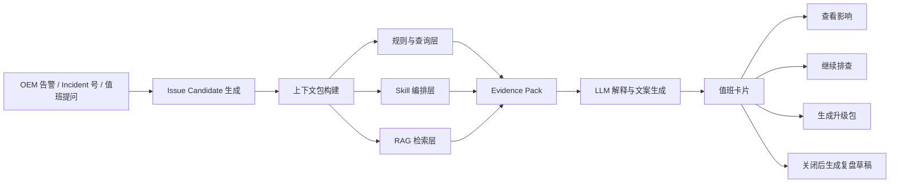

# Talk2OEM 深度分析报告

## 执行摘要

本报告的核心判断是：**Talk2OEM 最该做的，不是“把 OEM 接上一个聊天框”，而是把 OEM 已有的监控、事件、拓扑、时间序列、日志与运维知识，重组为一条面向一线值班运维的“问诊流水线”**。这一判断来自三个事实。第一，OEM 的 Management Repository 和 REST API 并不只提供告警，它们已经覆盖了目标资产、指标当前值与历史值、告警/事件序列、问题对象、作业执行、补丁与生命周期维护历史等可直接用于值班判断的事实数据；Oracle 还明确提供了文档化的发布视图与只读访问方式。citeturn19view0turn19view1turn13view2turn13view6turn21search6 第二，你现有的 Talk2OEM 方案已经具备正确底座：MCP/Skill 两层架构、OMR 优先、REST 补充、只读白名单、RAG、本地部署、客户私有大模型、结构化回答、Tool Trace，以及 LLM-first 但保留安全检查与 Allowed Views 的 NL2SQL 方案。fileciteturn0file0 fileciteturn0file1 fileciteturn0file3 第三，entity["company","New Relic","observability company"] 官方的 Response Intelligence 已经把一线值班的真实问题抽象得很清楚：先回答“影响了谁”“以前是否发生过”“现在先查什么”，而不是先给出一个貌似聪明的“根因按钮”；entity["company","Flashcat","observability platform company"] 对其公开动作的分析也指出，真正有价值的 AI RCA 不是会解释告警，而是把故障处理链路重新产品化。citeturn14view2turn13view0

因此，Talk2OEM 最有价值的定位应当是：

> **基于 OEM 的数据库值班问诊流水线**：  
> 从告警或问题提问出发，自动生成 Issue Candidate，拼装上下文包与证据包，给出初步判断、影响范围、检查路径、升级建议与交接材料，并把处理结果沉淀为组织记忆。

这一路线能够同时满足你提出的几个约束：一是**产品可复制**，因为它依赖 OEM 的标准数据面和统一 Skill 模型；二是**适合本地部署与私有大模型**，因为核心事实层都在客户侧，AI 只做受控编排、解释与知识检索；三是**适合 2 人团队在 8 周左右做出可验收的 POC**，因为最关键的部分不是大而全的平台，而是三类高频场景下的 Issue Candidate、证据包和交接包。fileciteturn0file0 fileciteturn0file3

## OEM 数据底座与现有能力

OEM 的价值，如果只停留在“监控告警”，会被严重低估。Oracle 官方文档明确说明，Management Repository Views 为目标、指标与监控信息提供公开访问，支持历史分析、额外计算、与工单系统集成，也特别强调**应只使用文档化视图，不应依赖未公开表/视图**；同时，BI Publisher 通过 `MGMT_VIEW` 这一内部专用只读用户访问已发布的 `MGMT$` 视图，并继续叠加目标级安全控制。换句话说，**Talk2OEM 完全可以把 OEM 当作一个正式、只读、可审计的运维事实底座来消费，而不是只能“看页面”**。citeturn19view0turn19view1

| 数据资产层 | OEM 已有能力 | 对一线值班的直接意义 | 对 Talk2OEM 的产品意义 | 依据 |
|---|---|---|---|---|
| 资产与拓扑 | `MGMT$TARGET` 提供 target 名称、类型、主机、最后一次装载时间；`MGMT$TARGET_ASSOCIATIONS`、`MGMT$TARGET_MEMBERS` 提供目标关联与成员关系。citeturn18view0turn13view5turn18view2 | 看到告警时，不只知道“哪个实例有问题”，还能快速扩展到同主机、同服务、同聚合目标的影响范围。 | 为 “影响判断”“关联对象扩展”“Issue Candidate 聚合” 提供结构化图谱。 | citeturn18view0turn13view5turn18view2 |
| 指标与时间线 | `MGMT$METRIC_CURRENT` 提供最新指标，`MGMT$METRIC_DETAILS` 提供滚动 7 天样本，`MGMT$METRIC_HOURLY/DAILY` 可做更长区间趋势；`MGMT$TARGET_TYPE` 提供指标标签、单位、说明。citeturn13view3turn16view0turn18view1turn19view0 | 值班最常问的是“现在是不是异常”“最近是不是越来越差”“这个指标到底什么意思”。 | 为“快速判断”“证据收集”“趋势检查”“中文语义到指标映射”提供事实层。 | citeturn13view3turn16view0turn18view1turn19view0 |
| 告警、事件与问题对象 | `MGMT$ALERT_CURRENT`、`MGMT$ALERT_HISTORY` 提供当前与历史告警；`MGMT$INCIDENTS` 给出 incident 级摘要；`MGMT$EVENTS_LATEST` 给出事件序列最新状态；`MGMT$PROBLEMS` 带有 `IS_ESCALATED`、`ESCALATION_LEVEL`、`PRIORITY`、`OWNER` 等字段。citeturn16view0turn16view1turn13view4 | 一线不是真的在处理“单条 metric”，而是在处理一个对象化的问题单元。 | 这是 Talk2OEM 构建 `Issue Candidate` 的最重要原料，尤其适合做“升级判断”和“工单交接包”。 | citeturn13view4turn16view0turn16view1 |
| 数据库与监听事实 | Oracle 文档列出了数据库 Alert Log 相关指标，表明 OEM 会周期性扫描 Alert Log 并形成告警类指标；Listener 目标可提供端口、地址、启动时间、连接建立、连接拒绝、响应时间等指标。citeturn10view2turn13view7turn11view3 | 这直接覆盖了值班最常见、最需要“快速初判”的数据库不可用、连接拒绝、ORA 错误、会话异常类问题。 | 可以做成最先落地的 Skill，而不是一开始就碰复杂 SQL 调优。 | citeturn10view2turn13view7turn11view3 |
| 主机日志与扩展监控 | Metric Extensions 可在 host、database、Exadata 等目标上扩展自定义指标；Generic Log File Monitor 可以对指定日志路径按模式扫描，还可通过 `lfm_ifiles` 上传命中内容，并用 `lfm_efiles` 永久排除敏感文件。citeturn15view5turn15view6 | 这意味着 `OS messages`、硬件日志、特定错误模式并不一定要另搭一套。 | 为“OS messages 摘要”“自定义硬件风险”“敏感日志受控接入”提供最低成本路径。 | citeturn15view5turn15view6 |
| 作业、补丁与变更痕迹 | `MGMT$JOB_EXECUTION_HISTORY`、`MGMT$CA_EXECUTIONS` 可追踪作业与 Corrective Action 执行情况；Lifecycle Maintenance History REST API 可查询数据库更新与升级的维护历史。citeturn15view4turn21search6turn21search0 | 值班最怕“变更刚做完，问题却查不到变更证据”。 | 这是“变更后异常对比”“升级判断”“复盘草稿”的关键增强项。 | citeturn15view4turn21search6turn21search0 |
| REST 补充面 | REST API 提供 incident 列表、事件详情、incident 成员事件、target 列表、metricGroups、latestData、metricTimeSeries 等接口。citeturn13view2turn13view6turn15view1turn15view2turn15view3 | 在 OMR 不方便开放全部视图时，仍可取到标准信息。 | 适合做受控补充、联调快、授权好讲。 | citeturn13view2turn13view6turn15view1turn15view2turn15view3 |

在这套底座之上，你现有的 Talk2OEM 架构并不空：当前材料已经明确提出“取数 + 诊断”两层架构，MCP Tool 负责认证和采集，AI Skills 结合规则、知识与 RAG 生成“结论 / 证据 / SOP 建议”的结构化结果，并支持 Tool Execution Trace、图表与文档检索；MVP 还明确了“问题识别 → OEM REST 取数 → 单文档知识库 → 结构化回答”的闭环，以及只读、会话缓存和 per-user 认证；NL2SQL 已改为 LLM-first，但安全检查、Allowed Views 和 SQL 安全逻辑保持不变；前端侧还有 VS Code 多会话和完整历史持久化设计。**也就是说，Talk2OEM 不是从零开始，真正缺的是“问题对象模型”和“一线工作流产品化”。** fileciteturn0file0 fileciteturn0file1 fileciteturn0file2 fileciteturn0file3

## 八类真实需求映射

下面这张表，把前面提出的 8 类数据库运维真实需求逐项展开，并对照 OEM 数据与现有 Talk2OEM 覆盖情况，给出缺口和优先级。这里的优先级是**以一线值班价值和 2 人团队 POC 可交付性**来排的。

| 真实需求 | 一线现场场景 | 可用 OEM 数据与视图 | 现有 Talk2OEM 覆盖 | 主要缺口 | 优先级 |
|---|---|---|---|---|---|
| 快速判断 | 半夜收到 target down、连接异常、硬件风险告警，第一反应是“这是不是一个真问题，现在急不急”。 | `MGMT$TARGET`、`MGMT$ALERT_CURRENT`、`MGMT$ALERT_HISTORY`、`MGMT$AVAILABILITY_HISTORY`、`MGMT$INCIDENTS`、`MGMT$EVENTS_LATEST`、`MGMT$METRIC_CURRENT`、`MGMT$METRIC_DETAILS`。citeturn18view0turn16view0turn16view1turn13view4turn13view3 | 已有 OMR/REST 取数、结构化回答、Tool Trace、NL2SQL 白名单查询。fileciteturn0file0 fileciteturn0file1 | 还没有把多条告警归并成一个 `Issue Candidate`，也没有统一 triage 评分、持续性判断和置信度输出。 | P0 |
| 影响判断 | 值班最想知道“影响谁，是单点还是一串对象，会不会影响业务窗口”。 | `MGMT$TARGET_ASSOCIATIONS`、`MGMT$TARGET_MEMBERS`、`MGMT$INCIDENT_TARGET`、`MGMT$PROBLEMS`、REST `/targets`。OEM 关联视图天然适合做 blast radius 扩展。citeturn13view5turn18view2turn13view4turn15view3 | 已有 target 查询与路由能力，但没有专门的“影响扩展”卡片。fileciteturn0file3 | 缺一个“主对象 + 关联对象 + 受影响服务/目标组”的标准化影响模型。 | P0 |
| 证据收集 | 真正交给 DBA 或二线前，必须把时间、对象、关键指标、同窗事件、最近变更一次带齐。 | `MGMT$METRIC_DETAILS`、`MGMT$ALERT_HISTORY`、`MGMT$INCIDENT_ANNOTATION`、`MGMT$EVENT_ANNOTATION`、Listener/Alert Log metrics、`MGMT$JOB_EXECUTION_HISTORY`、`MGMT$CA_EXECUTIONS`、LCM history。citeturn16view0turn16view1turn13view4turn11view3turn10view2turn15view4turn21search6 | 已有“结论 / 证据 / SOP 建议”输出骨架。fileciteturn0file0 | 缺统一的 Evidence Pack schema；缺时间窗拼接、最近变更拼接和“缺失证据项”。 | P0 |
| 下一步路径 | 值班并不需要十种可能性，而是需要“先查什么，再查什么，看到什么就停，看到什么就升级”。 | `MGMT$TARGET_TYPE` 提供指标标签/单位/描述；`MGMT$ALERT_CURRENT` 与历史告警自带 action message；New Relic 的 What to check 设计证明这一层对一线最关键。citeturn18view1turn16view0turn14view2 | Skills + RAG 方向正确，MVP 已支持固定模板回答。fileciteturn0file0 fileciteturn0file3 | 缺按场景固化的调查路径 Skill，尤其是 if/then 式的分支和停止条件。 | P0 |
| 升级判断 | 一线常问“要不要叫 DBA / 系统 / 厂商，现在叫是否证据充分”。 | `MGMT$PROBLEMS` 中已有 `IS_ESCALATED`、`ESCALATION_LEVEL`、`PRIORITY`、`OWNER`，incident/event annotations 还能沉淀历史交接信息。citeturn13view4 | 目前更多是“建议”，还不是标准化升级包。fileciteturn0file0 | 缺升级评分、标准交接模板、必要字段校验和一键导出。 | P0 |
| 降低认知负担 | 值班痛点不是数据没有，而是页面太多、概念太散、文档太碎。 | OMR 公开视图本身就覆盖 target、metric、alert、event、job、history；New Relic 的 issue page 证明“单页汇总上下文”是有效思路。citeturn19view0turn14view2 | VS Code 会话与持久化方案可以承载连续问诊。fileciteturn0file2 | 缺少“一线视角”的固定卡片与按钮；当前更像工程控制台，而不是值班工作台。 | P0 |
| 风险控制 | 值班系统如果不可信、不透明、乱查敏感数据，就不会被生产环境接受。 | Oracle 明确要求使用文档化视图；`MGMT_VIEW` 是只读；REST 读接口可白名单；Generic Log Monitor 支持敏感文件排除。citeturn19view0turn19view1turn13view2turn15view6 | 已有本地部署、私有模型、只读白名单、SQL 安全检查、暂不自动修复。fileciteturn0file0 fileciteturn0file1 fileciteturn0file3 | 需要把“置信度 / 不确定项 / 缺失证据 / 审计链”显式产品化，而不是停留在工程约束。 | P0 |
| 组织记忆 | 运维经验不在监控里，而在 SOP、复盘、批注、变更记录与“上次怎么处理”里。 | New Relic 用 RAG 接 retrospective/postmortem；OEM 自身有 incident/problem annotations、告警历史、job/history；Talk2OEM 已有 RAG 和会话持久化。citeturn14view0turn13view4 fileciteturn0file0 fileciteturn0file2 | 已有 KB 方向，但 MVP 还是单文档知识库。fileciteturn0file3 | 缺“类似问题检索 + 最终结论回写 + 自动复盘草稿”闭环。 | P1 |

从这张表可以看出一个很重要的结论：**Talk2OEM 的价值点并不在“能不能查 OEM”，而在“能不能把 OEM 数据资产重组为一线的最小决策单元”**。也就是：从“单条告警 + 多个页面”转成“一个 Issue Candidate + 一个证据包 + 三个下一步按钮”。这正是 New Relic issue 抽象与 Flashcat 所强调“不是按钮，而是流水线”的启发在数据库运维场景中的落地方式。citeturn14view2turn13view0

## AI 与传统工程的边界

Talk2OEM 要避免两个极端。一个极端是“没有 AI 也能做，所以 AI 没价值”；另一个极端是“有了 AI，规则、白名单、证据链都不重要了”。更稳妥的分工是：**传统工程负责事实、时序、关联和安全；AI 负责把事实变成可问、可懂、可交接、可复盘的工作流。** 这个分工与现有 Talk2OEM 设计、Oracle 公开视图能力、以及 New Relic 在 causal analysis 与 AI summary 之间的分层都一致。fileciteturn0file0 fileciteturn0file1 citeturn14view2

| 能力 | 传统工程可独立实现 | AI 是否必须介入 | 推荐实现方式 | 判断 |
|---|---|---|---|---|
| 告警归并、事件去重、状态判断 | 可以。基于 target、时间窗、severity、event sequence 足够可做。citeturn13view4turn16view0 | 不必。 | 规则 + 时间窗 + 事件序列聚合。 | **传统优先** |
| 当前值/趋势/持续性判断 | 可以。OEM 本身就有 current/details/hourly/daily。citeturn13view3turn16view0turn19view0 | 不必。 | 参数化查询 + 统计计算。 | **传统优先** |
| 影响范围扩展 | 可以。依赖 target associations/members。citeturn13view5turn18view2 | 非必须。 | 目标关系图 + 规则扩展。 | **传统优先** |
| 变更/补丁/作业事实收集 | 可以。依赖 job history、CA executions、LCM history。citeturn15view4turn21search6 | 非必须。 | 标准查询模板。 | **传统优先** |
| 自然语言意图识别 | 若不用 AI，只能做固定菜单、固定意图槽位。 | 是。Talk2OEM 的 “Talk” 如果要支持自由问法，AI 几乎不可替代。 | 轻量意图分类 + 槽位提取 + 白名单路由。 | **AI 必要** |
| 非结构化知识检索 | 关键词检索能做，但对 SOP、复盘、变更文档的召回/切片质量通常不够。 | 是，至少在“显著提升”层面必需。 | RAG + 结构化过滤 + 文档来源回显。 | **AI 必要** |
| 证据解释 | 传统系统只能罗列图表和值。 | 强烈建议。 | 让模型只基于 Evidence Pack 解释，不允许跳出证据瞎猜。 | **AI 强增强** |
| 升级交接包生成 | 模板可以做，但覆盖不了复杂现场语言。 | 强烈建议。 | 数据模板 + LLM 文本组织 + 字段完整检查。 | **AI 强增强** |
| 复盘草稿生成 | 纯模板可做，但体验差、利用率低。 | 强烈建议。 | 读取会话、证据包、最终结论，自动成稿待确认。 | **AI 强增强** |
| 最终处置执行 | 可做，但高风险；当前边界也不允许。 | 不应由 AI 主导。 | 先不做；任何自动化都应审批、审计、回滚。 | **暂不做** |

真正**不可替代**、或者说“不用 AI 就不配叫 Talk2OEM”的环节，建议限定在下面五个，而且每个都有明确实现方式：

| AI 不可替代环节 | 为什么不用 AI 会明显降级 | 建议实现方式 |
|---|---|---|
| 自然语言到数据计划 | 值班人员不会记住 `MGMT$METRIC_DETAILS`、`metricGroupName`、`targetType`、变量组合；只靠预设菜单，产品会退化成普通工作台。 | 意图识别 → 槽位抽取 → 视图/API 白名单选择 → 参数化查询。NL2SQL 只作为窄域补充，不是默认主路径。fileciteturn0file1 |
| SOP / 复盘 / 变更文档的语义检索 | 同一个问题在文档里可能叫“连接风暴”“listener 拒绝”“会话打满”“批量作业拖垮”，关键词检索召回不稳。 | RAG 检索时同时利用 issue 类型、target、时间窗、错误码、变更窗口过滤。citeturn14view0turn14view3 |
| 证据解释与候选原因排序 | 传统系统给“事实”，但值班要的是“这串事实更像什么问题，应先排除什么”。 | 让模型只读取结构化 Evidence Pack，输出“支持/反对/待确认”三段式解释，并附置信度。citeturn14view2turn13view0 |
| 升级交接包生成 | 一线最痛苦的是升级时说不清楚；纯规则模板难以把跨源事实转成自然、完整、可发送的摘要。 | 使用固定字段模板约束模型输出，自动补齐“对象、时间、现象、关键指标、已排除项、建议下一步”。 |
| 复盘草稿与组织记忆沉淀 | 如果全靠人工补复盘，大概率会烂尾；如果没有长期沉淀，Talk2OEM 每次都像“新值班同学”。 | 在事件关闭时自动生成复盘草稿，人工仅确认最终原因和无效步骤，再进入知识库。 |

需要特别强调的是，**AI 不应该承担“事实裁判”的角色**。Oracle 文档已经给了足够多的结构化事实面，New Relic 自己也把 causal analysis 与 LLM-generated analysis 分开：前者更偏算法和结构化分析，后者是在因果引擎不能识别时再补行动建议。对 Talk2OEM 来说，这意味着：**阈值、持续性、时窗、关联、升级条件都应先由规则与结构化查询给出，AI 只在这些事实之上做理解、解释与生成。** citeturn14view2turn19view0

## 一线采纳与功能设计

“零额外工作量”的核心，不是把输入框做得更大，而是**让值班人员不用重述上下文、不用手工拼证据、不用自己决定下一跳去哪里看**。New Relic 的 issue page 把这件事做成了固定动作：先看 impacted，再看 previously，再看 what to check。Talk2OEM 在数据库场景中最应该复制的，不是页面样子，而是这种“先回答一线最关心的三件事”的交互顺序。citeturn14view2

上图里的关键不是 LLM，而是 **Issue Candidate → 上下文包 → Evidence Pack**。Flashcat 对 New Relic 的分析强调，AI RCA 不能只是“告警解释按钮”，必须围绕 Issue、事件关联、影响分析、相似问题与工作流去设计；New Relic 官方则把 issue page 里的 AI summary 做成针对 first responders 的单页上下文。Talk2OEM 也应该采用这一中间层。citeturn13view0turn14view2

建议先统一一份**证据包结构**，再在其上长出 Skill 与 UI。推荐结构如下：

| 证据包字段 | 内容 | 主要来源 |
|---|---|---|
| `issue_id` | Talk2OEM 自定义编号，或绑定 incident/problem 编号 | `MGMT$INCIDENTS` / `MGMT$PROBLEMS` citeturn13view4 |
| `primary_target` | 主对象：数据库/实例/主机/监听 | `MGMT$TARGET` / REST `/targets` citeturn18view0turn15view3 |
| `related_targets` | 关联对象：同主机、同服务、同聚合目标 | `MGMT$TARGET_ASSOCIATIONS` / `MGMT$TARGET_MEMBERS` citeturn13view5turn18view2 |
| `time_window` | 默认最近 30 分钟，可扩到 7 天比较 | `MGMT$METRIC_DETAILS` / `MGMT$ALERT_HISTORY` citeturn16view0turn16view1 |
| `current_state` | 当前严重级别、是否 open、是否仍在发生 | `MGMT$ALERT_CURRENT` / `MGMT$EVENTS_LATEST` citeturn16view0turn13view4 |
| `key_metrics` | 当前值、趋势、阈值、变化方向 | `MGMT$METRIC_CURRENT` / `MGMT$METRIC_DETAILS` / `MGMT$TARGET_TYPE` citeturn13view3turn16view0turn18view1 |
| `related_events` | 同窗事件/incident/member events | `MGMT$INCIDENTS` / `MGMT$EVENTS_LATEST` / REST incident-event APIs citeturn13view4turn13view2 |
| `recent_changes` | 近期 job、CA、patch、upgrade、配置/变更 | `MGMT$JOB_EXECUTION_HISTORY` / `MGMT$CA_EXECUTIONS` / LCM history citeturn15view4turn21search6 |
| `knowledge_hits` | 命中的 SOP、复盘、变更说明 | RAG 文档库 + 会话历史 fileciteturn0file0 fileciteturn0file2 |
| `missing_facts` | 还缺哪些证据，不够支持结论 | 系统计算 |
| `confidence` | 高/中/低 + 原因 | 规则结果 + 模型校正 |

在此基础上，可以给 8 类需求直接设计 Talk2OEM 的功能卡片，而不是让用户自己问一串追问：

| 需求 | 最佳输入 | Skill 流程 | 输出重点 | 一线按钮与交接 |
|---|---|---|---|---|
| 快速判断 | Incident 号 / 告警 URL / target 名 + 默认近 30 分钟 | `triage_skill`: availability + current alert + same-window events + 7d baseline | 当前是否紧急、是真异常还是抖动、建议观察还是继续查 | `[看趋势] [看影响] [生成交接包]` |
| 影响判断 | 在 triage 卡片点“看影响” | `blast_radius_skill`: expand related targets + same-host/service/group | 影响对象列表、单点/多点、潜在业务窗口风险 | `[只看数据库层] [扩展到主机/监听]` |
| 证据收集 | 点“继续排查”或问“把证据整理一下” | `evidence_pack_skill`: metrics + history + incident members + change history | 一页证据包，默认可复制到工单/IM | `[复制摘要] [导出JSON] [生成升级说明]` |
| 下一步路径 | 问“我现在先查什么” | `playbook_skill`: 按场景执行 if/then 检查路径 | 三步以内的检查顺序与停止条件 | `[看第一步详情] [我已确认第一步正常] [直接升级]` |
| 升级判断 | 问“需不需要叫 DBA/系统/厂商” | `escalation_skill`: severity + evidence completeness + prior similar cases | 升级对象、升级理由、还缺什么 | `[生成 DBA 交接包] [生成系统组交接包]` |
| 降低认知负担 | 不要求用户手工描述，直接粘贴 incident 号 | `context_prefill_skill`: resolve incident and prefill time window | 用户开口越少越好，先给卡片再允许追问 | `[查看原始事件] [查看历史相似问题]` |
| 风险控制 | 默认触发 | `guardrail_skill`: 白名单检查、敏感字段脱敏、置信度评估 | 明确可查/不可查、证据充分/不足 | `[为什么不给结论] [查看审计记录]` |
| 组织记忆 | 事件关闭时触发 | `closure_skill`: summarize + ask final cause + draft retrospective | 自动复盘草稿、可沉淀 SOP 草案 | `[确认最终原因] [标记误报] [加入知识库]` |

为了真正吸引一线值班人员，Talk2OEM 的界面不应从“聊天”开始，而应从**卡片和按钮**开始。下列四种交付物样例，建议作为 POC 必须交出来的用户可见成果。

**Issue Candidate 卡片模板**

| 字段 | 示例 |
|---|---|
| Issue Candidate | IC-2026-04-25-018 |
| 主对象 | x9mdbadm01 / LISTENER_SCAN1 |
| 当前判断 | 连接拒绝持续上升，更像 listener/后端服务可用性问题，不像单纯 SQL 慢 |
| 严重程度 | 高 |
| 是否建议立即升级 | 建议联系 DBA；如 10 分钟内继续上升，再同步系统组 |
| 关键证据 | 连接拒绝 15 分钟连续上升；同窗出现 database service down 事件；最近 2 小时有 patch job |
| 缺失证据 | 暂无 listener log 原文；尚未确认近期参数变更 |
| 推荐第一步 | 先核对 listener target 状态与 service 注册状态 |
| 快捷按钮 | 查看影响 / 看最近变更 / 生成 DBA 交接包 |

**证据包示例**

| 模块 | 示例内容 |
|---|---|
| 时间窗 | 2026-04-25 01:40 ～ 02:12 |
| 当前状态 | Incident open；severity = Critical；latest event = Connections Refused |
| 指标 | Connections Refused/min：0 → 18 → 45；Listener Response Time 增高；DB 可用性波动 |
| 同窗事件 | service down、listener refused、session terminated alert log error |
| 关联对象 | 同主机 db01、listener_scan1、service app_rw |
| 最近变更 | 01:15 执行 patch validation job；无成功 CA 执行 |
| 历史相似 | 近 90 天有 2 次同类事件，其中 1 次因服务未注册，1 次因后端实例重启 |
| 命中知识 | 《Listener 连接拒绝处理 SOP》；《4 月批量补丁后连接异常复盘》 |

**升级交接包示例**

> **给 DBA 的交接摘要**  
> 主对象：x9mdbadm01 / LISTENER_SCAN1  
> 时间窗：01:40 ～ 02:12  
> 现象：listener 拒绝连接持续增高，当前为 open critical incident。  
> 关键证据：  
> - Connections Refused/min 在 15 分钟内从 0 升至 45；  
> - OEM member events 同窗出现 database service down；  
> - 最近 2 小时有 patch validation job；  
> - 当前未拿到 listener log 原文，仍需确认 TNS-125xx / service registration 细节。  
> 一线已排除：主机网络接口无明显错误，值班通道正常。  
> 建议 DBA 下一步：核对 service 注册状态、listener status、实例状态与最近变更影响。  
> 置信度：中高。更支持 listener/service 路径，不支持“单纯 SQL 变慢”路径。

**复盘草稿示例**

> **事件复盘初稿**  
> 事件名称：凌晨连接拒绝持续升高  
> 发生时间：2026-04-25 01:40  
> 结束时间：2026-04-25 02:35  
> 影响范围：app_rw 服务连接失败，影响批处理窗口  
> 现场判断：Talk2OEM 初判为 listener/service 可用性路径，建议 DBA 介入  
> 最终原因：待人工确认  
> 有效排查项：连接拒绝趋势、member events、最近 change history  
> 无效排查项：过早从 SQL 调优方向切入  
> 后续建议：将 “patch 后 listener/service 注册核对” 加入变更后巡检 SOP

真正的“零额外工作量”路径，不需要一开始重做 OEM 插件。对 2 人团队最现实的嵌入方案是：

| 入口 | 一线动作 | Talk2OEM 动作 |
|---|---|---|
| OEM 告警通知 / IM 消息 | 点击“用 Talk2OEM 解读” | 自动带入 incident ID、target、时间窗 |
| 工单系统 | 粘贴 incident 编号 | 自动拉取 incident、events、current metrics |
| 当前 VS Code/轻前端控制台 | 输入一句“帮我看 incident 381942，要不要叫 DBA？” | 直接输出 triage 卡片，而不是让用户自己先描述症状 |

一个符合一线习惯的**最小交互示例**应当像这样：

> 值班：帮我看 incident 381942，要不要叫 DBA？  
> Talk2OEM：  
> **当前判断**：建议联系 DBA，但暂不需要同步厂商。  
> **原因**：同窗有 database service down + listener refused，且最近 30 分钟事件未自行清除。  
> **下一步**：先核对 service 注册 / listener status。  
> **按钮**：`[查看影响] [看最近变更] [生成 DBA 交接包]`

这类交互的价值，不是“会聊天”，而是**只说一句话，就能让系统自己完成 target 解析、时间窗选择、视图组合、知识召回和交接文案编制**。没有 AI，前半段的查询工作台能做出来；但没有 AI，Talk2OEM 的 “Talk” 就会退化成一个又一个固定表单和报表菜单。fileciteturn0file2 citeturn14view2turn13view0

## POC 落地方案

结合 OEM 数据可得性、值班痛点和 2 人团队约束，最适合的 POC 不是覆盖“所有数据库运维场景”，而是先做三个**高频、可复用、易验收、且能体现 OEM 资产价值**的场景。

| POC 场景 | 为什么优先做 | 主要 OEM 数据 | 交付形态 | 验收指标 | 数据取样方法 | 2 人团队工期估算 |
|---|---|---|---|---|---|---|
| 连接异常与可用性问诊 | 一线最高频，价值直观，能直接体现“需不需要叫 DBA”。 | Listener metrics、availability、incidents/events、alert history、service 关联。citeturn11view3turn16view0turn13view4 | triage 卡片 + 影响卡片 + DBA 交接包 | 初判耗时下降；无效升级率下降；证据完整率 | 抽近 3 个月 20–30 个 listener refused / target down / service down 事件；若历史时间戳不足，用工单/IM时间补齐 | 2.5–3 周 |
| 硬件风险与主机异常问诊 | 更容易体现 OEM 不只是数据库监控，还能盘活主机/扩展日志资产。 | Metric Extensions、自定义硬件指标、Generic Log File Monitor、同主机关联对象。citeturn15view5turn15view6turn13view5 | 风险判断卡片 + OS messages 摘要 + 系统组交接包 | 风险误报率；升级建议准确率；证据采纳率 | 抽 15–20 个磁盘错误、硬件告警、messages 异常样本；若 OEM 尚未采集 messages，则同时验证 Metric Extension 方案 | 2–2.5 周 |
| 变更后异常对比 | 客户领导最容易认可，也最能体现 OEM 的“作业/补丁/历史”价值。 | job history、CA executions、LCM history、metric timeline、alert history。citeturn15view4turn21search6turn16view1 | 变更后异常卡片 + 变更关联说明 + 复盘草稿 | 变更关联命中率；排查路径缩短；复盘初稿采纳率 | 选 10–15 个有 patch/job/change 记录的事件回放，并要求专家给出“是否由变更触发”的标签 | 2–2.5 周 |

如果按**单一 POC** 来规划，我建议总工期控制在 **8 周左右**，并按下表组织工作项：

| 工作项 | 主要内容 | 预估人天 |
|---|---|---|
| OMR/REST 白名单打通 | 管理视图清单、权限、认证、目标解析、查询模板 | 10–12 |
| Issue Candidate 与 Evidence Pack | 告警归并、时窗规则、证据 schema、统一输出 | 12–15 |
| 三个核心 Skill | 连接异常、硬件风险、变更后异常 | 18–22 |
| RAG 与类似问题检索 | SOP/复盘/变更文档切片、元数据标签 | 8–10 |
| 前端卡片与交接导出 | triage 卡片、按钮、交接包、复盘草稿 | 10–12 |
| 评估与调优 | 样本标注、A/B 回放、误导防护、置信度策略 | 10–12 |
| **合计** |  | **68–83 人天** |

按 2 人投入计算，这大致对应 **7–8.5 周**。直接现金成本方面，如果客户已有 OEM、已有私有大模型与可用 VM/K8s 资源，**新增现金成本通常不是主项**，主要成本在人力；若需要独立部署一套轻量服务，POC 级别通常只需 1–2 台中小型应用节点和一个轻量向量/检索组件即可。更关键的是**不要把钱花在做“大平台”或大而全前端上**，而要集中在：Issue Candidate、证据包、3 个 Skill、知识库切片和交接包导出这五件事上。

验收指标建议也应围绕值班现场，而不是过早承诺整体 MTTR。更稳妥的 POC 验收口径如下：

| 指标 | 定义 | 说明 |
|---|---|---|
| 初判耗时 | 从用户发起问诊到拿到“严重性 + 下一步建议”的时间 | 这是 Talk2OEM 最直接能改善的指标 |
| 证据完整率 | 卡片是否包含对象、时间窗、关键指标、同窗事件、变更/知识命中 | 建议用 10 项 checklist 评分 |
| 无效升级率 | 最终复核认为“一线本可无需升级”的比例 | 这一项最能体现客户侧价值 |
| 升级包可用率 | DBA/二线是否认为交接内容足以继续排查 | 建议用 5 分制打分 |
| 误导率 | 建议方向严重错误、导致明显走错路 | 这项必须尽量接近 0 |
| 知识命中率 | 是否能正确命中 SOP/复盘/变更文档 | 体现组织记忆是否真的被用起来 |

这些指标的采样方式，建议采用**历史回放 + 影子运行**的组合：先拿历史样本验证规则和输出完整性，再拿 1–2 周真实值班问题做“影子诊断”，由 DBA 或更资深值班确认对错。不要一开始就试图拿系统自动恢复时间做主 KPI，因为你当前边界明确是“诊断与建议自动化”，而不是执行自动化。

## 风险与合规

Talk2OEM 想进入客户生产环境，最大的阻力往往不是功能，而是**安全、审计、授权与误导风险**。这一部分必须在产品设计上前置，而不是在项目后期补。

| 风险点 | 风险说明 | 控制措施 | 依据 |
|---|---|---|---|
| 使用未公开视图/表 | Oracle 明确要求只使用文档化视图，未文档化对象无向后兼容保证。 | OMR 只允许 `MGMT$` 已发布视图；建立白名单清单，不访问 base tables。 | citeturn19view0 |
| 读写越界 | 客户最担心 AI 乱查、乱改、乱跑 SQL。 | 固定只读账号；优先 `MGMT_VIEW` 或等价只读方式；REST 只开放 GET 类接口；当前阶段不做动作执行。 | citeturn19view1turn13view2turn13view6 fileciteturn0file0 fileciteturn0file3 |
| NL2SQL 误生成危险查询 | 自然语言生成 SQL 容易越权、低效或误查。 | 采用“预置 Skill 查询模板为主，窄域 LLM-first 为辅”；保留 `_is_safe_sql`、`ALLOWED_VIEWS`、行数限制和关键字禁用。 | fileciteturn0file1 |
| 敏感日志与匹配内容泄露 | OS logs / listener logs 可能含地址、路径、账号等敏感内容。 | 对 Generic Log Monitor 使用 `lfm_efiles` 排除敏感文件；必要时仅上传摘要不上传原文；输出阶段做脱敏。 | citeturn15view6 |
| 法务/授权边界 | OEM 某些数据库生命周期、配置比较、补丁功能属于管理包授权范畴，不能模糊处理。 | 在 POC 前按功能点做一次授权复核，尤其是 Lifecycle/Configuration/Change 相关页面、报告、CLI/API 能力。 | citeturn22view0 |
| AI 误导 | 一线最怕系统“说得像真相”，却把人带到错方向。 | 输出必须包含置信度、支持证据、反证和缺失证据；允许明确说“不足以下结论”。 | citeturn14view2turn13view0 |
| 不可审计 | 如果无法回放“它为什么这么说”，值班和领导都会不信。 | 每次问诊保留 Tool Trace、查询参数、命中文档、模型版本、输出模板版本。 | fileciteturn0file0 |
| 一线额外负担 | 如果要值班手工贴很多上下文，Talk2OEM 会被放弃。 | 入口优先基于 incident ID / alert URL 的自动预填；默认先出卡片，再允许追问。 | citeturn14view2 |
| 前端形态误判 | 把产品做成工程师玩具，而不是值班工具。 | 当前 VS Code 形态可用于 POC，但正式采纳要以“卡片 + 按钮 + 导出包”为核心，不以 IDE 炫技为核心。 | fileciteturn0file0 fileciteturn0file2 |

综合来看，Talk2OEM 真正能打动一线运维的价值，不是“会聊天”，也不是“自动根因分析”这类容易引发怀疑的叙事，而是下面这句话：

> **它把 OEM 从“监控页面”升级成“值班事实底座”，让一线在最少操作下拿到最关键的五个答案：这是不是个真问题、影响谁、证据在哪、下一步查什么、要不要升级。**

AI 在这里不是装饰，也不是替代传统运维，而是恰到好处地承担五件传统工程很难做好的事情：**自然语言到查询计划、跨文档语义检索、证据解释、升级包生成、复盘草稿沉淀**。其余事实面、规则面和安全面，仍然应由 OEM 数据资产与受控工程实现承担。只要坚持这个边界，Talk2OEM 就既能“盘活 OEM 的丰富数据资产”，又不会落入“为了 AI 而 AI”的陷阱。