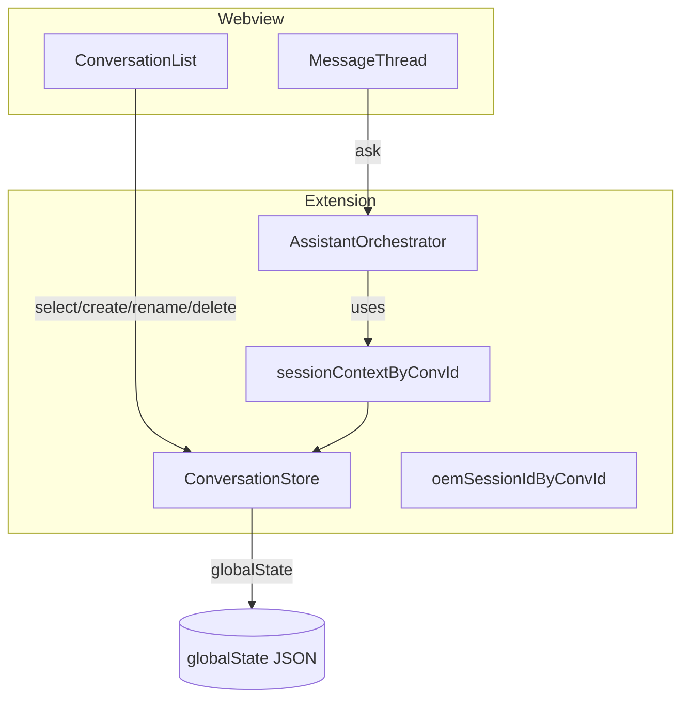

# 多会话控制台与历史持久化（类 ChatGPT Web UI）

## 代码范围（强制）

- **仅修改** `[alert-mcp-vscode-extension/](alert-mcp-vscode-extension/)` 下 TypeScript/HTML（含 `extension.ts`、`chatPanel.ts`、新增 `conversationStore.ts`、类型等）。
- **不修改** 仓库内 Python 后端与 MCP 服务：`[src/mcp_server.py](src/mcp_server.py)`、`[src/service.py](src/service.py)` 等 **一律不动**；本特性不依赖、也不预留后端 API。
- 文档：若需记录变更，可在扩展内 `[README.md](alert-mcp-vscode-extension/README.md)` 或根目录 `[ISSUE_LOG.md](ISSUE_LOG.md)` 追加一条；**非必须**。

## 现状（约束）

- `[alert-mcp-vscode-extension/src/views/chatPanel.ts](alert-mcp-vscode-extension/src/views/chatPanel.ts)`：`renderHtml()` 内嵌单栏聊天区；`[ChatPanel](alert-mcp-vscode-extension/src/views/chatPanel.ts)` 为单例（`ChatPanel.current`），标题固定为 `OEM Assistant Console`。
- `[alert-mcp-vscode-extension/src/extension.ts](alert-mcp-vscode-extension/src/extension.ts)`：`sessionContext: ChatTurn[]` 与 `oemSessionId` 为进程内变量；`alertMcp.disconnectMcp` 会清空 `sessionContext`；**无磁盘持久化**。
- LLM 调用链：`askAssistant` → `orchestrator.ask(userQuestion, sessionContext, ...)`，见 `[extension.ts` 约 97–112 行](alert-mcp-vscode-extension/src/extension.ts)。

## 目标行为（与需求对齐）

| 能力         | 设计要点                                                                                                                                                                        |
| ---------- | --------------------------------------------------------------------------------------------------------------------------------------------------------------------------- |
| 多个 console | 在**同一 Webview** 内做左侧会话列表 + 右侧消息区（ChatGPT 式），不采用多个 `createWebviewPanel` 窗口；避免与现有单例冲突、减少窗口管理成本。                                                                               |
| 重命名        | 会话项支持内联编辑或弹出 `showInputBox`；更新 `title` 并写回存储。                                                                                                                               |
| 保存内容       | **自动保存**：每条用户消息与助手回复**完整**落盘；助手侧持久化**完整** `[AssistantResult](alert-mcp-vscode-extension/src/types/appTypes.ts)`（含 `finalText` 与全部 `steps`，不截断 `detail`）。可选 debounce 降低写入频率。 |
| 删除历史       | 列表项删除按钮 → `showWarningMessage` 确认 → 从存储移除；若删的是当前会话则切换到其它会话或新建空会话。                                                                                                           |
| 每用户自己的内容   | 使用 `vscode.ExtensionContext.globalState` 存会话索引与正文（**本机当前 VS Code 用户配置下**一份数据）；若需**按工作区**隔离，仅在扩展内加设置项切换 `workspaceState` / `globalState`。                                    |

## 数据模型（建议）

- `**ConversationMeta`**：`id`（uuid）、`title`、`updatedAt`（number，ms）。
- `**ConversationSnapshot`**：`meta` + `messages: ChatMessage[]`。
- `**ChatMessage**`：至少 `id`、`role: 'user' | 'assistant' | 'info'`、`createdAt`；`user` 存完整用户原文；`assistant` 存**完整** `AssistantResult` 序列化（或等价结构），用于 1:1 还原气泡、可折叠步骤与 tool 结果。
- **存储键**：例如 `oemAssistant.conversations.v1` + 当前 `activeConversationId`（`globalState` 或 `workspaceState`，由设置决定）。

### 持久化策略：不截断（强制）

- **实现代码不得**对消息条数、单条字符数、`steps` 或 `detail` 做**人为截断**以缩小体积。
- VS Code `globalState` 对单键体积有**平台/实现上限**；若 `update` 因过大失败，应向用户展示明确错误（例如 `showErrorMessage`），**不**静默丢弃或裁剪内容。若日后确需更大容量，再单独做「扩展侧分片存储或文件落盘」等**仍属扩展内方案**，不纳入本次后端改动。

## UI 结构（Webview）

- 布局：`flex` 左右分栏；左侧固定宽度（可拖拽或 CSS `min-width`），列表顶栏：**新建会话**、可选 **搜索**（后续迭代）。
- 列表项：标题（可点击选中）、**重命名**（铅笔 / 双击）、**删除**（垃圾桶）；当前项高亮。
- 右侧：沿用现有 `#log` 气泡逻辑；切换会话时清空 DOM 再按快照渲染（或 diff 更新，MVP 用全量重绘即可）。
- 初始化：`postMessage` 请求扩展下发「会话列表 + 当前会话完整内容」；扩展用 `globalState` 读出后 `postMessage` 一次。

## 扩展端（`extension.ts` + 新模块）

- **新建模块**（建议）`[alert-mcp-vscode-extension/src/services/conversationStore.ts](alert-mcp-vscode-extension/src/services/conversationStore.ts)`：封装 `list / get / create / rename / delete / appendTurn / setActive`，内部读写 `globalState`（JSON 序列化），**写入完整负载**。
- **会话与 orchestrator 绑定**：
  - 将 `sessionContext: ChatTurn[]` 改为「**当前 activeConversationId 对应的数组**」：维护 `Map<string, ChatTurn[]>` 或每次从 `ConversationStore` 同步该会话的 turns（推荐内存 Map + 定期与 store 同步，避免每轮全量读盘）。
  - `oemSessionId`：按会话隔离为 `Map<string, string | undefined>`，避免多会话串登录态。
- `**disconnectMcp`**：只清空 MCP 连接相关状态；**不再清空**持久化会话列表（与 ChatGPT 一致）；若需「清空上下文」可另加按钮仅清当前会话的 `sessionContext`（可选，MVP 可不做）。
- **消息协议**（webview ↔ extension）：例如 `conversations/init`、`conversation/select`、`conversation/create`、`conversation/rename`、`conversation/delete`、`conversation/append-local`（用户侧气泡可先本地追加，再 `ask`）、`ask` 成功后扩展 `postMessage` 写回助手侧。

`[ChatPanel](alert-mcp-vscode-extension/src/views/chatPanel.ts)` 增加方法：`postConversationsState(...)`、`postActiveConversation(...)`，与现有 `postAssistantResult` 并列。

## 与 `[AssistantOrchestrator](alert-mcp-vscode-extension/src/orchestration/assistantOrchestrator.ts)` 的关系

- 接口不变：仍传入当前会话的 `ChatTurn[]` 切片。
- 持久化层序列化**完整** `AssistantResult`，与 UI 还原需求一致；**无**「只存摘要」的裁剪路径。

## 风险与边界

- **敏感信息**：对话可能含 OEM 输出；`globalState` 为明文 JSON，与当前扩展行为一致；后续若加脱敏或导出，仍在扩展内完成。
- **多窗口**：若用户开两个 VS Code 窗口，同一 `globalState` 并发写入可能覆盖；MVP 可接受；后续可用版本号 + merge 或单写者锁。
- **存储上限**：见上文「不截断」——失败时提示用户，不静默截断。

## 建议实施顺序

1. `ConversationStore` + 类型定义（`[appTypes.ts](alert-mcp-vscode-extension/src/types/appTypes.ts)` 扩展）。
2. Webview 布局 + 列表交互（仅 UI，假数据）。
3. 接线：选会话 / 新建 / 重命名 / 删除 + 加载历史到 `#log`（完整还原）。
4. 将 `askAssistant` 与 `sessionContext` / `oemSessionId` 改为按会话；成功后 append 并 **完整** `save`。
5. 标题栏：`panel.title = 当前会话 title`（可选）。

