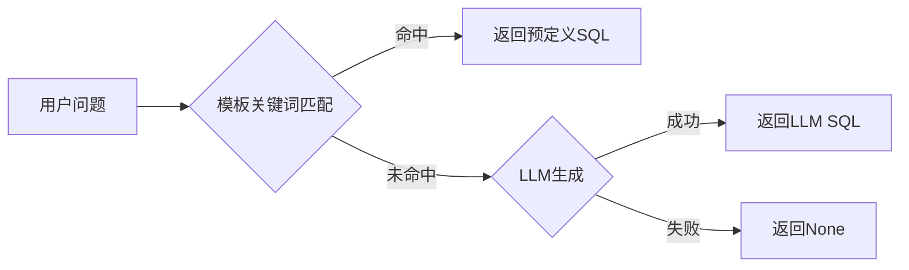
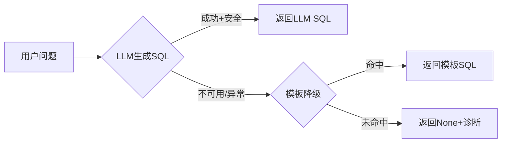

# NL2SQL 引擎重构：LLM-first 方案

## 问题根因

当前 `generate()` 的执行顺序：




问题在于模板覆盖面窄（5个固定模式），且模板返回的SQL过于宽泛（如"会话"命中后返回该目标全部指标，没有针对session做过滤）。用户问"活动会话数"时，即使模板命中也返回100条不相关指标；如果稍微换个问法（如"连接数"、"并发会话"）则直接无法匹配。

## 改造目标




**LLM 是主路径**，模板仅作为 LLM 不可用时的离线降级。

## 具体改动（仅 [src/nl2sql_engine.py](src/nl2sql_engine.py)）

### 1. 改造 LLM prompt：加入 few-shot 示例

当前 prompt 只有 schema 描述和规则，LLM 缺乏"怎么把中文概念映射到 COLUMN_LABEL"的示范。加入 5-8 组 few-shot 示例：

```
Q: "查看 omrd 数据库的活动会话数"
SQL: SELECT target_name, column_label, value, collection_timestamp
     FROM sysman.mgmt$metric_current
     WHERE LOWER(target_name) = LOWER('omrd')
       AND (column_label LIKE '%Session%' OR column_label LIKE '%Logon%')
     ORDER BY collection_timestamp DESC FETCH FIRST 20 ROWS ONLY

Q: "列出所有主机"
SQL: SELECT target_name, target_type, host_name
     FROM mgmt$target WHERE target_type = 'host' FETCH FIRST 200 ROWS ONLY

Q: "omrd 的 CPU 使用率是多少"
SQL: SELECT target_name, column_label, value, collection_timestamp
     FROM sysman.mgmt$metric_current
     WHERE LOWER(target_name) = LOWER('omrd')
       AND (column_label LIKE '%CPU%')
     FETCH FIRST 20 ROWS ONLY

Q: "当前有哪些未关闭的告警"
SQL: SELECT target_name, summary_msg, severity, priority, last_updated_date
     FROM mgmt$incidents WHERE open_status = 1
     ORDER BY last_updated_date DESC FETCH FIRST 100 ROWS ONLY

Q: "omrd 数据库的内存使用情况"
SQL: SELECT target_name, column_label, value, collection_timestamp
     FROM sysman.mgmt$metric_current
     WHERE LOWER(target_name) = LOWER('omrd')
       AND (column_label LIKE '%Memory%' OR column_label LIKE '%SGA%' OR column_label LIKE '%PGA%')
     FETCH FIRST 30 ROWS ONLY
```

这些示例教会 LLM 三个关键模式：

- 目标查询 → `mgmt$target`
- 指标查询 → `sysman.mgmt$metric_current` + `column_label LIKE` 过滤
- 告警查询 → `mgmt$incidents` + `open_status` 过滤

### 2. 调整 `generate()` 执行顺序

```python
def generate(self, question: str) -> Optional[SqlPlan]:
    self.last_rejection = None

    # LLM 优先
    if self._chain:
        plan = self._try_llm(question)
        if plan:
            return plan

    # LLM 不可用或失败时，模板降级
    template = self._template_sql(question)
    if template:
        safe, reason = self._is_safe_sql(template)
        if safe:
            return SqlPlan(sql=template, source="template")
        self.last_rejection = SqlRejection(sql=template, reason=reason)

    return None
```

将 LLM 调用逻辑提取为 `_try_llm()` 方法保持 `generate()` 简洁。

### 3. 保留 `_template_sql` 不变

模板作为 LLM 不可用时的降级手段，不需要扩展覆盖面。现有 5 个模板覆盖最高频场景即可。

### 4. `_is_safe_sql` 和 `ALLOWED_VIEWS` 不变

安全检查逻辑和白名单维持现状。

## 不改动的文件

- `service.py`：调用 `self._nl2sql.generate()` 的接口不变
- `mcp_server.py`：不涉及
- `config/metric_map.yaml`：不涉及

