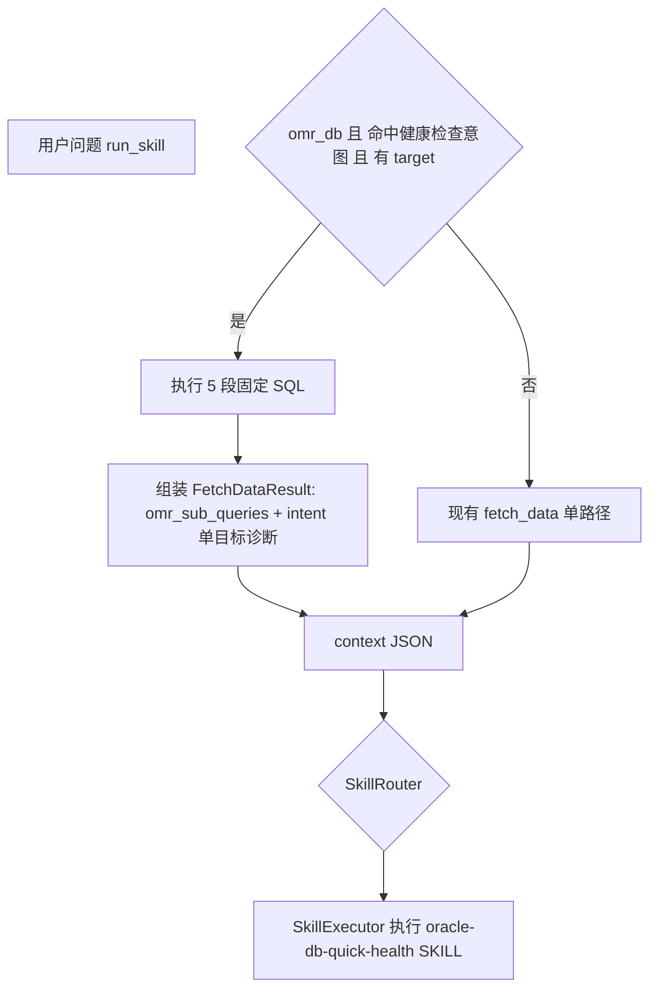

# Oracle 数据库快速健康检查 Skill（MVP）

## 1. 现状与约束（基于代码）

- **Skill 机制**（`[src/skill_engine.py](e:\edwin\AIGC\askoem\src\skill_engine.py)`）：启动扫描 `skills/*/SKILL.md`，`SkillRouter`（LLM）从 `name`+`description` 摘要中选一个 Skill；`SkillExecutor` 将**整份 SKILL 正文** + **OEM context JSON** + 用户问题生成诊断。
- `**run_skill` 数据**（`[AskOpsService.run_skill_with_llm](e:\edwin\AIGC\askoem\src\service.py)`）：先 `**fetch_data(question)`**（OMR 下为 NL2SQL 单条或 `_split_mixed_omr_question` 多段），再组 `context`（`latest_data`/`metric_time_series` 等已截断）→ `_skill_engine.process`。
- **omr_db 短路**（同文件约 236–256 行）：若 `latest_data` 非空且 `intent_type` **不在** `{单目标诊断, 目标清单, 监控项清单}`，则 `**builtin_query_reply`**，不会进入 Skill。因此「健康检查」必须让该次取数结果的 `**intent_type` 为「单目标诊断」**（或调整短路条件，改动面更大；MVP 优先前者）。
- **NL2SQL 硬约束**（`[nl2sql_engine.py](e:\edwin\AIGC\askoem\src\nl2sql_engine.py)`）：**禁止** `V$SESSION` 等库内动态视图；时间范围历史指标必须用 `**SYSMAN.MGMT$METRIC_DETAILS`** + `COLLECTION_TIMESTAMP`；当前快照用 `**MGMT$METRIC_CURRENT`**。文档已说明 CPU/内存/IO/Session/Wait 等可通过 `METRIC_NAME`/`COLUMN_LABEL` 等过滤。
- **旧计划**（`[skill_mvp_与自动路由_8bea108d.plan.md](c:\Users\edwinjiang\.cursor\plans\skill_mvp_与自动路由_8bea108d.plan.md)`）中「解析 triggers、混合路由、可选 skill_name」与当前仓库**未完全落地**；本次 Skill **不依赖** triggers 解析，路由仍以 **description 摘要 + 可选强制** 为主。
- **代码健康**：`[service.py](e:\edwin\AIGC\askoem\src\service.py)` 中多处 `try:` / `if alert_related:` 与缩进异常（如 177–178、993–994、1089–1095、1145–1147 行附近），**应在实现本功能前修复**，否则 `run_skill`/`fetch` 行为不可靠。

### 1.1 与现有 CPU Skill 的关系：目录独立、引擎共享

| 层级      | 独立                                                                                                                                                                                                                                                         | 共享                                                                                                                                                                                             |
| ------- | ---------------------------------------------------------------------------------------------------------------------------------------------------------------------------------------------------------------------------------------------------------- | ---------------------------------------------------------------------------------------------------------------------------------------------------------------------------------------------- |
| **资产**  | 每个 Skill 独占目录：`[skills/cpu_alert_mvp/](e:\edwin\AIGC\askoem\skills\cpu_alert_mvp\)`、本计划新增 `skills/oracle_health_check_mvp/`。各自 `SKILL.md`、`references/`、`assets/` **不合并**；**frontmatter `name` 全局唯一**（如 `cpu-alert-diagnosis` 与 `oracle-db-quick-health`）。 | 无强制「公共 SKILL 片段」；若日后多处复用说明文字，可再引入 `skills/_shared/`（MVP 不需要）。                                                                                                                                  |
| **运行时** | 健康检查专用 **Python** 模块（`[oracle_health_check_bundle.py](e:\edwin\AIGC\askoem\src\oracle_health_check_bundle.py)` 拟定名）仅服务本 Skill；CPU Skill **不**依赖该 bundle。                                                                                                   | `[SkillRegistry` / `SkillRouter` / `SkillExecutor` / `AgentSkillsEngine](e:\edwin\AIGC\askoem\src\skill_engine.py)` **只有一套**；`[run_skill_with_llm](e:\edwin\AIGC\askoem\src\service.py)` 统一入口。 |
| **取数**  | 健康检查走 **bundle**；CPU 告警场景走 **通用 `fetch_data`（NL2SQL / OEM）**，两条路径在 `run_skill_with_llm` 内分支，**不**把两套 SQL 写进对方目录。                                                                                                                                           | `context` 字典结构、`_finalize_run_skill_result`、`report` 版式 **共用**。                                                                                                                                |

### 1.2 问题识别与调用哪个 Skill（路由）

- **现有机制**：`[SkillRouter](e:\edwin\AIGC\askoem\src\skill_engine.py)` 把 **所有已注册 Skill 的 `name` + `description` 摘要** 与用户问题交给 LLM（temperature=0），输出 **唯一** Skill 名或 `**NONE`**。
- **本计划中的增强（与互斥描述）**：
  - **文案层**：在 `oracle-db-quick-health` 的 `**description`** 中明确 **适用**（快速健康检查、多维度、时间窗巡检）与 **不适用**（单纯「CPU 高告警怎么处置」、单场景告警 SOP）；与 `[cpu_alert_mvp/SKILL.md](e:\edwin\AIGC\askoem\skills\cpu_alert_mvp\SKILL.md)` 的 `description` / `non_triggers` **语义拉开**，降低 Router 混选。
  - **可选参数**：`run_skill(..., skill_name=...)`（见旧计划）用于 **跳过 Router**、调试或用户显式指定。
  - **规则路由（后续）**：`triggers` 关键词先匹配再 LLM，**未列为 MVP 必做**。
- **与「健康检查 bundle」的一致性（重要）**：若 `run_skill_with_llm` 已判定走 **健康检查 bundle**（关键词 + `omr_db` + 有 target），则 **数据** 与 **SKILL 正文** 必须一致。MVP 推荐二选一：**(a)** 命中 bundle 时 **强制** `skill_name = oracle-db-quick-health` 并 **跳过 SkillRouter**；**(b)** 命中 bundle 时仍走 Router，但 **校验** 结果须为该名，否则回退强制。避免「数据是五维巡检、执行阶段却用 CPU 告警 Skill」的错配。

## 2. 设计原则（落地、不冗余）

| 原则                     | 说明                                                                                                                                    |
| ---------------------- | ------------------------------------------------------------------------------------------------------------------------------------- |
| **数据可信**               | 五类指标不靠「用户一句自然语言 + 单次 NL2SQL」赌覆盖；在 **omr_db** 下对健康检查走 **预置分块 SQL**（仍仅白名单视图）。                                                           |
| **Skill 职责清晰**         | Skill 负责**解读 context、对照 Workflow 输出四段**；不负责拼 SQL。                                                                                     |
| **与 cpu_alert_mvp 一致** | 同目录结构：`SKILL.md` + 可选 `references/`；frontmatter `name`/`description`/`triggers`（triggers 可先只作文档，与旧计划后续解析兼容）。                          |
| **目标必填**               | 从问题中解析 **目标名**（复用 `[intent_parser._extract_target_name](e:\edwin\AIGC\askoem\src\intent_parser.py)` 或健康检查专用正则）；缺失则 **追问**，不执行 bundle。 |

说明：需求中的 **「CPUI」按 CPU** 理解；**活动会话**在 OEM 侧用 **Session/并发** 类 metric（`MGMT$METRIC_DETAILS`），不查 `V$SESSION`。

## 2. Skill、Workflow 与「数据 bundle」的分层（详细说明）

### 2.1 你对 Skill / Workflow 的理解（合理，且与业界常见表述一致）

- **Skill** 在抽象上描述 **一件事如何处理**：目标、输入、**分步怎么做**（Workflow）、输出长什么样（Constraints）、边界。
- **Workflow** 在理想形态下是 **可执行过程**：先做什么、再做什么；**调用哪些工具**、拿到什么结果、再如何综合。

本仓库 **当前实现**（`[skill_engine.py](e:\edwin\AIGC\askoem\src\skill_engine.py)` + `[run_skill_with_llm](e:\edwin\AIGC\askoem\src\service.py)`）与「理想形态」的差异需要明确：

| 维度           | 理想形态（你描述的）                   | 当前 askoem MVP                                                                                   |
| ------------ | ---------------------------- | ----------------------------------------------------------------------------------------------- |
| Workflow 谁执行 | 运行时逐步调度「工具」                  | **没有**独立 Workflow 引擎；`SKILL.md` 的 Workflow 是给 **SkillExecutor 里的一次 LLM 调用** 读的**说明文字**          |
| 工具调用         | Skill 每一步调 MCP tool / 内部 API | `run_skill` **先**统一取数（`fetch_data` 或本方案中的 bundle），**再**把结果塞进 `context`，**最后**一次 LLM 按 SKILL 写诊断 |
| 输出           | 每步中间结果可审计                    | 中间结果主要是 **context JSON** + 最终 `result` 文本                                                       |

因此：**Skill 在代码里不等于「自动机 + 多轮 tool 调用」**；它等于 **「注册过的 playbook（SKILL.md）+ 路由 + 单次执行 LLM」**。扩展成「Workflow 逐步调工具」需要另做 **Skill 运行时**（或 LangGraph 等），**不在本 MVP 范围**。

### 2.2 本方案里 Workflow 写什么、执行什么

**写在 `[skills/oracle_health_check_mvp/SKILL.md](e:\edwin\AIGC\askoem\skills\oracle_health_check_mvp\SKILL.md)` 里的 Workflow（建议细化为可操作段落）：**

1. **输入假设**：`context` 中已包含 **五个逻辑块** 的 OEM 指标数据（CPU / 内存 / IO / 等待 / 会话），时间范围为 **最近约 30 分钟**，目标为 **指定数据库（或监控目标）**；若某块为空，在「证据」中写明「该维度无采集行」，不编造数值。
2. **阅读顺序**：先逐块看 **是否有明显尖峰、持续高位、与前后时点突变**；再 **跨块对照**（例如 IO 与 Wait 同时异常时优先怀疑存储/ SQL 大量读写）。
3. **结论**：用一句话概括整体健康度（正常 / 需关注 / 高风险），**必须引用** context 中的字段或行作为证据。
4. **证据**：按五块列出关键数值或「无数据」；注明时间范围与目标名。
5. **可执行建议**：最多 3 条，每条对应证据（例如：进一步查某类 Wait、对比业务窗口）。
6. **深挖入口**：Grafana / OEM 页面或文档（若 `references/` 有则引用）。

以上内容 **由 LLM 在 SkillExecutor 中执行一次** 完成，**不是**循环多步 API。

### 2.3 `oracle_health_check_bundle.py` 算不算「Skill 的一部分」？

**结论（分层表述）：**

- **仓库文件归属**：`oracle_health_check_bundle.py` 放在 `[src/](e:\edwin\AIGC\askoem\src)`**，不属于** `skills/` 目录下的 markdown 资产；**不是** SKILL.md 里的一个「步骤文件」。
- **产品语义**：它实现的是 **该 Skill 在 Workflow 里隐含的第一步——「采集证据」**；与 SKILL 文档 **配套**，属于**同一功能竖切**（Oracle 快速健康检查）的 **服务端数据层**。
- **为何不放 SKILL 里用自然语言驱动 NL2SQL**：五类指标 + 30 分钟 + 白名单视图，单靠用户一句问话走 NL2SQL **不稳定**；bundle 用 **固定、可审计的 SQL** 保证输入覆盖，**SKILL 只负责「如何基于这些输入下结论」**，职责分离清晰。

可记一句：**bundle = Workflow 中「取数」步骤的代码实现；SKILL.md = Workflow 中「解读与输出」步骤的 LLM 说明。** 二者合起来才是完整的「健康检查 Skill 能力」；注册表只加载 `.md`，**执行路径**由 `run_skill_with_llm` 在命中健康检查时 **显式调用** bundle。

### 2.4 若未来要贴近「Workflow 逐步调工具」

可选演进（本计划不实现）：`SkillExecutor` 或新组件按 SKILL 中 **编号的步骤** 调 `fetch_data` / `execute_omr_sql` / 其他 MCP tool，每步结果再进入下一步。代价是 **编排引擎、状态、超时、费用** 都上升；MVP 保持 **单次取数 + 单次诊断** 即可交付价值。

## 3. 推荐架构（数据层 + Skill 层）

- **命中条件**（MVP 建议二选一或组合，实现时选最简）：
  - **A**：`intent_parser` 增加关键词 → `**INTENT_SINGLE_DIAGNOSIS`**（如「快速健康检查」「数据库健康」「半小时内 CPU 内存 IO」等）；
  - **B**：`run_skill` 增加可选参数 `**skill_name`**（与旧计划一致），传入且等于新 Skill 的 `name` 时走 bundle（便于调试）。
- **数据 bundle**：新建小模块（例如 `[src/oracle_health_check_bundle.py](e:\edwin\AIGC\askoem\src\oracle_health_check_bundle.py)`）导出：
  - `is_health_check_question(question: str) -> bool`
  - `fetch_health_check_rows(omr_client, target_name: str, target_type: str | None) -> list[dict]`  
  内部 **5 条 SQL**（结构一致：`* FROM SYSMAN.MGMT$METRIC_DETAILS WHERE LOWER(target_name)=… AND collection_timestamp >= SYSTIMESTAMP - NUMTODSINTERVAL(30,'MINUTE')` + 各段 **METRIC_NAME/COLUMN_LABEL** 过滤），每段查询附 `**_health_section`**：`cpu` / `memory` / `io` / `wait` / `session`；每段 `**ROWNUM <= N`**（如 200）防撑爆 context。
- `**run_skill_with_llm` 集成点**：在调用 `fetch_data` **之前**判断：若 `data_source_mode == "omr_db"` 且命中健康检查且已解析 `target_name`，则 **不调用** 原 `fetch_data`，改为构造与 `[_fetch_data_from_omr_multi](e:\edwin\AIGC\askoem\src\service.py)` 相同形态的 `**omr_sub_queries`**（5 个子结果，每个含 `sub_question`、`latest_data`、`generated_sql`），并设置 `**intent_type=INTENT_SINGLE_DIAGNOSIS`**，`**need_follow_up=False**`（数据为空时 Skill 仍可根据 SKILL 说明写「无采集数据」）。
- **SkillExecutor 入参**：现有 `context` 已包含 `latest_data`/`metric_time_series`；建议 **额外传入** `health_check_sections` 或在 `latest_data` 中保留每行 `_health_section`，便于 LLM 分段引用（二选一，优先 **子查询分块** 已与 `omr_sub_queries` 对齐，扩展最少）。
- **Router**：新 Skill 的 `description` 写清英文+中文触发词；若实现 `**skill_name` 强制**，则 `AgentSkillsEngine.process` 在传入 `skill_name` 时 **跳过 Router**（小改 `[skill_engine.py](e:\edwin\AIGC\askoem\src\skill_engine.py)`）。

### 3.1 OEM 五指标取数 SQL：预置模板 + 参数（不用 NL2SQL 生成整段 SQL）

**结论：五段查询的骨架（FROM/WHERE 结构、指标维度过滤模式）采用「提前写好的参数化模板」，由 Python 绑定参数后执行；不依赖 NL2SQL 现场生成这 5 条 SQL。**

| 方式         | 作用                                                                                              | 本方案                                                                   |
| ---------- | ----------------------------------------------------------------------------------------------- | --------------------------------------------------------------------- |
| **预置模板**   | SELECT 形态、`SYSMAN.MGMT$METRIC_DETAILS`、时间条件、`METRIC_NAME`/`COLUMN_LABEL` 的 LIKE/IN 组合固定，仅替换绑定参数 | **采用**：保证五类维度每次都能跑、可单元测试、可审计                                          |
| **NL2SQL** | 自然语言 → 任意 SQL                                                                                   | **不用于**健康检查五段的主体生成（易拒答、与「五段一致覆盖」冲突）；仍保留 `**fetch_data` 通用路径**给非健康检查问题 |

**参数化（鲁棒性核心）：**

1. **时间窗口**：不是写死 30 分钟。从用户问题解析 **「最近 N 分钟/小时」**（复用或扩展 `[intent_parser._parse_time_range](e:\edwin\AIGC\askoem\src\intent_parser.py)` / 新增 `parse_health_check_minutes(question) -> int`）。**默认 30**；未写时间用默认；**clamp** 到合理区间（例如 **5～1440 分钟**），防止一次拉全表撑爆 context。
2. **SQL 中时间条件**：`collection_timestamp >= SYSTIMESTAMP - NUMTODSINTERVAL(:mins, 'MINUTE')`（或等价 `INTERVAL`），`:mins` 来自上一步解析结果。
3. **监控对象（单个或多个）**：
  - **MVP 最小**：仅 **单 `target_name`**（`LOWER(target_name) = LOWER(:one)`），问题里未写清则追问。
  - **扩展（建议同一迭代或紧跟迭代）**：解析 **多个目标**（逗号分隔、中文「与/和」、或多次 `_extract_target_name` 增强），SQL 使用 `LOWER(target_name) IN (:n1, :n2, …)` 或 `OR` 列表；**每段仍 5 条 SQL**，结果行带 `target_name` 列，SKILL 中要求 LLM **按目标分组**或**对比说明**。
  - 若目标数超过上限（例如 **>5 个**），**截断并告警**或强制用户缩小范围，避免 token 爆炸。
4. **五段维度**：每段仍是独立查询（CPU / 内存 / IO / Wait / Session），段内过滤条件预置为 **文档化模式**（与 `[nl2sql_engine.py](e:\edwin\AIGC\askoem\src\nl2sql_engine.py)` VIEW 说明一致），避免 NL2SQL 漂移。
5. **行数上限**：每段每查询 `ROWNUM <= N`（如 200），多目标时总量仍受 `N` 与 `max_rows_total` 约束。

**与 NL2SQL 的分工**：健康检查走 **bundle 模板**；用户问法不属于健康检查命中规则时，仍走现有 `**fetch_data` + NL2SQL**，两套路径并存。

### 3.2 混合问句：「快速健康检查 + 附加维度（例如锁）」当前逻辑与优化

**示例问句**：「对 omrdb 进行一次快速检查，另外把锁的信息也加进去」。

**若仅实现「固定五段模板、无附加解析」时的行为**：

- 仍命中 **健康检查** → 只执行 **五段 SQL**，context 里 **没有**专门针对「锁」的额外结果行（除非某段 `wait` 模板的 LIKE 碰巧覆盖到 Enqueue 类列名，**不可依赖**）。
- SkillExecutor 仍按 SKILL 写回答：模型 **没有**锁相关证据时，要么 **漏答「锁」**，要么 **编造**——**不符合预期**。

**能力边界（OMR / 白名单）**：

- 不能在 OMR 直连路径使用 `V$LOCK`、`GV$SESSION` 等库内视图（与 `[nl2sql_engine.py](e:\edwin\AIGC\askoem\src\nl2sql_engine.py)` 一致）。
- 「锁」在 OEM 仓库侧通常体现为 **指标**：如 Enqueue Waits、Enqueue Deadlocks、Maximum Blocked Session Count 等（VIEW 描述与列名参考已存在于引擎的 metric 列表中），应从 `**SYSMAN.MGMT$METRIC_DETAILS`** 按 **metric/column 过滤** 取同一时间窗。

**推荐优化（写入实现方案，避免过度复杂）**：

1. **从问句解析「附加维度」**（关键词，非 LLM）：例如 `锁|阻塞|enqueue|死锁|blocked` → 置位 `extra_sections.lock_metrics = True`；后续可扩展 `tablespace` 等，每类对应 **一条额外预置模板** 或 **与某段合并的扩展过滤**。
2. **第 6 段（或命名子块）模板**：`MGMT$METRIC_DETAILS` + 与锁相关的 `METRIC_NAME`/`COLUMN_LABEL`/`METRIC_COLUMN` 过滤（与现有 nl2sql 文档中的 Enqueue/Blocked 等指标名一致），时间与目标参数与五段 **相同**；结果并入 `omr_sub_queries`（例如 `sub_question: "lock/enqueue metrics (OEM repo)"`）。
3. **SKILL.md 明确写法**：「锁」小节证据来自 **OEM 采集的 Enqueue/阻塞类指标**；**不是**实例内行级锁明细；若该段无行，在证据中写「本时间窗无此类采集」。
4. **不推荐**：为「加锁」单独再走 **整条 NL2SQL** 与五段 bundle **拼接**（两套 SQL 策略并存易不一致）；若某附加维度极难模板化，再考虑 **受控的**单次 NL2SQL 子查询作为 **optional fallback**（单独验收）。

**与 Router 的关系**：问句同时含「快速检查」与「锁」仍路由到 **同一 Skill**；仅 **bundle 输出多一块数据**。

## 4. SKILL 内容要点（`skills/oracle_health_check_mvp/SKILL.md`）

- `**name`**：如 `oracle-db-quick-health`（全局唯一，与目录名可不同但建议一致性好维护）。
- `**description`**：Oracle 库在 **用户指定或默认的时间窗口内** 对 **CPU、内存、IO、等待类指标、会话/并发类指标** 做快速巡检；用户要求时可含 **Enqueue/阻塞类 OEM 指标**（语义见 §3.2，非 V$ 行级锁）；窗口由服务端解析。
- **Workflow**：按 context 中实际分段解读（五段或五段+锁指标段）；单目标或多目标；**Constraints** 与 `[.cursor/rules/ai-gateway-mvp.mdc](e:\edwin\AIGC\askoem\.cursor\rules\ai-gateway-mvp.mdc)` 四段一致。
- `**references/`**（建议）：OMR 下「锁」与 OEM 指标对应关系，避免与 DBA 行级锁视图混淆。

## 5. 前端展示（VS Code Webview）设计

### 5.1 现状（与实现强相关）

- 助手气泡主文：`[chatPanelHtml.ts](e:\edwin\AIGC\askoem\alert-mcp-vscode-extension\src\views\chatPanelHtml.ts)` 中 `renderAssistantBubble` 对 `.answer-body` 使用 `**textContent`** 打字机输出 `**result.finalText`**，**无 Markdown 渲染**。
- `@` 链式工具：`[assistantOrchestrator.ts](e:\edwin\AIGC\askoem\alert-mcp-vscode-extension\src\orchestration\assistantOrchestrator.ts)` 对最后一轮工具结果使用 `**formatToolResultForDisplay`**（`fetch_data` 优先 `llm_summary`，否则 `report`）；再 `**stripSqlExecutionTraceFromReportText`**，主答**去掉** `【SQL 执行追踪】` 段，避免主文刷屏 SQL。
- **Tool Execution Trace**：`
` 内步骤 `**detail`** 使用 `**formatToolResultForExecutionTrace`**，保留**完整** `report`（含 SQL），与主文分离。
- **数据图表**：仅 `fetch_data_from_oem` 且 `buildFetchDataChartsPayload` 有图时，在气泡下挂 **「数据图表」** 区块；`**run_skill` 当前无独立可视化块**。

### 5.2 健康检查结果展示目标

- **主答区**：用户一眼看到 **四段**（结论 / 证据 / 下一步建议 / 深挖入口），层次清晰，**不**与 Trace 中 SQL 重复挤在同一屏（Trace 仍完整可查）。
- **Trace**：行为不变，便于审计 SQL 与 `skill_name`。

### 5.3 推荐方案（分档，由简到繁）

**档 A — 仅后端约定（必做，零前端依赖）**

- Skill 输出（`result` 正文）**固定带四个小节标题**（与网关一致），例如：`【结论】`、`【证据】`、`【下一步建议】`、`【深挖入口】`（标题文案可与 `.cursor/rules/ai-gateway-mvp.mdc` 对齐）。
- 前端仍为纯文本，**靠换行与标题**即可读；**验收可过**。

**档 B — 轻量样式（推荐 MVP+）**

- 在 `**renderAssistantBubble`** 中：若能从 `**steps`** 中解析出最后一轮工具为 `run_skill` 且 JSON 含 `**skill_name`** 为 `oracle-db-quick-health`（或约定前缀 `oracle-db-quick-health`），则将 `**finalText`** 按上述四个标题 **正则拆分**，生成 **4 个带 class 的块**（如 `div.oem-hc-section`），标题用 `div.oem-hc-h`、正文用 `div.oem-hc-body`；**使用 `innerHTML` 时必须对除结构外的正文做 `escapeHtml`**（或仅对白名单标题拆段，段落内容仍 escape）。
- **不**引入 Markdown 库；**不**改 `AssistantResult` 类型（除非团队希望结构化字段再上档 C）。
- 若用户走 **多轮对话由 LLM 转述** `run_skill` 结果而非 `@` 直链，可能丢失 `skill_name` 元数据 → 档 B 可 **回退**为档 A 纯文本。

**档 C — 结构化载荷（后续）**

- MCP `run_skill` 增加 `**sections: Array<{ title: string; body: string }>`**（由服务端从 LLM 输出解析或约束 JSON）；扩展 `[appTypes.ts](e:\edwin\AIGC\askoem\alert-mcp-vscode-extension\src\types\appTypes.ts)` `AssistantResult` 或 `ExecutionStep` 扩展字段；Webview 专门渲染。**改动面大**，本计划不列为 MVP 必达。

### 5.4 MVP 意见：**文字 + Trace + 指标图表**（图文并茂）

- **赞成纳入 MVP**：健康检查的核心价值是「看趋势/对比」，`MGMT$METRIC_DETAILS` 带 `COLLECTION_TIMESTAMP` 与 `VALUE`，天然适合 **时间序列折线图**；与现有 **Chart.js + `oem-fetch-charts`** 一致，用户心智与 `fetch_data` 对齐。
- **范围控制**：图表 **只读**、**不**替代四段文字结论；图用于 **佐证** Trace 中的 SQL 与正文中的证据，避免只做图不做结论。
- **数量**：与现有上限一致（例如最多 **10 张图**），可按 **维度分块**（CPU / 内存 / IO / Wait / Session / 锁）每类 0～1 张，或 **多系列合并** 由 `buildFetchDataChartsPayload` 规则决定。

### 5.5 实现要点（复用扩展管线，少造轮子）

**后端（Python）**

- `run_skill` 成功响应中，除 `result` / `report` / `skill_name` 外，增加与 `fetch_data_from_oem` **同构** 的 `**data`** 字段（或顶层 `latest_data` + `metric_time_series`），使 **bundle 合并后的行** 或 `omr_sub_queries` 展平后能被 JSON 序列化进工具返回。
- 若与 `build_fetch_tool_report` 结构一致困难，至少保证：`**ok: true`** + `data.latest_data` 为 `list[dict]`（含 `COLLECTION_TIMESTAMP`、`VALUE`、`COLUMN_LABEL`/`METRIC_NAME` 等），便于扩展侧 **同一套** `buildFetchDataChartsPayload` 解析（必要时在 `[buildFetchDataChartsPayload.ts](e:\edwin\AIGC\askoem\alert-mcp-vscode-extension\src\charts\buildFetchDataChartsPayload.ts)` 增加 **轻量分支**：`root.skill_name === 'oracle-db-quick-health'` 时优先按子查询分面或 `metric_time_series`）。

**扩展（TypeScript）**

- `[assistantOrchestrator.ts](e:\edwin\AIGC\askoem\alert-mcp-vscode-extension\src\orchestration\assistantOrchestrator.ts)`：在 `toolName === 'run_skill'` 且 `skill_name` 为健康检查 Skill 时，若 `buildFetchDataChartsPayload(toolResult, question)` 返回非空，则 `**chainResultStep.fetchCharts = fc`**（与 `fetch_data_from_oem` 同路径）。
- `[chatPanelHtml.ts](e:\edwin\AIGC\askoem\alert-mcp-vscode-extension\src\views\chatPanelHtml.ts)`：**无需**新容器；`collectAllFetchCharts` 已合并 `steps[].fetchCharts`，只要步骤上挂载即可出现 **「数据图表」** 区块；标题可改为 **「数据图表」** 或对健康检查单独 **「健康检查指标」**（小改文案）。

**失败/空数据**

- 无行或无可解析时间列：**不**渲染图表区块；**不**报错；正文仍由 Skill 说明「无采集」。

## 6. MCP 与测试

- `[mcp_server.run_skill](e:\edwin\AIGC\askoem\src\mcp_server.py)`：文档字符串更新；若加 `**skill_name`**，在参数中声明可选；健康检查成功路径 **返回 `data`（与 fetch_data 对齐）** 供扩展画图（见 §5.5）。
- **测试**：`pytest` 对 `is_health_check_question`、SQL 字符串仅含白名单视图（静态断言）、以及 **mock omr_client** 返回空/非空时 `run_skill_with_llm` 是否进入 Skill（`skill_name` 非 `builtin_query_reply`）。

## 7. 不在本轮范围（避免过度设计）

- 前端 VS Code 自动优先 `run_skill`（旧计划阶段 B）。
- 解析 YAML `triggers` 做规则路由（可后续与旧计划合并）。
- 非 omr_db（REST OEM）五段并行 API 拉取（若需可另开任务）。

## 8. 验收标准

- 在 **omr_db** 配置下，对「**{DB名} 快速健康检查 [可选时间]**」类问题，`run_skill` 返回 `**skill_name` 为 `oracle-db-quick-health`**（与 bundle 一致，不与 `cpu-alert-diagnosis` 错配），`report` 中含参数化后的 SQL / 子查询说明；回答为 **四段结构**；时间与单/多目标符合 §3.1。
- 「快速检查 + **加锁信息**」：context 含 §3.2 附加段或等价数据；回答中锁/阻塞有证据或写明无采集；不引入 V$。
- 未带目标名时 **追问**，不执行无效 SQL。
- 不引入白名单外视图；与现有 NL2SQL 安全策略一致。
- **前端**：主答含四段标题（档 A）；若实施档 B，则 `@run_skill` 链式结果对 `oracle-db-quick-health` 呈现分段样式且无 XSS（正文 escape）。
- **图表（MVP）**：在开启「显示数据图表」且 `run_skill` 返回含可绘图 `data` 时，气泡下出现 **与健康检查一致的 Chart.js 区块**（与 `fetch_data` 共用管线）；无数据则仅文字+Trace。

