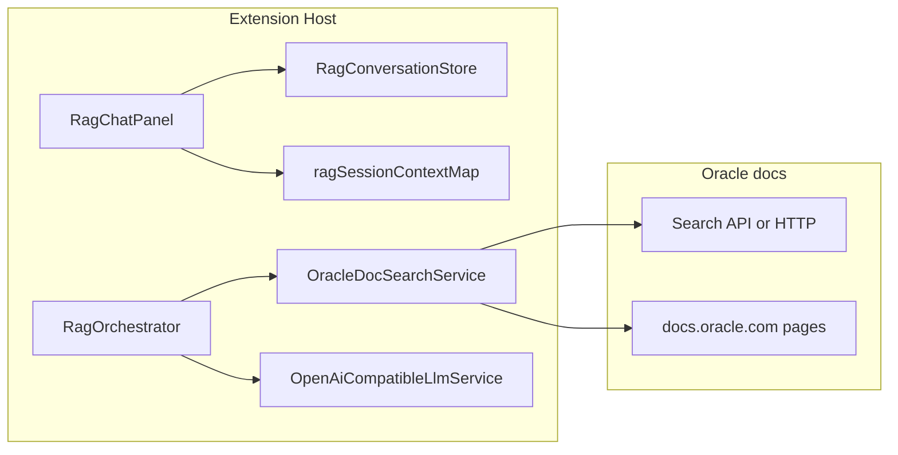

# RAG Console（独立面板 + 会话全功能 + Oracle 文档链接）

## 现状约束（代码事实）

- `[alert-mcp-vscode-extension/src/views/chatPanel.ts](alert-mcp-vscode-extension/src/views/chatPanel.ts)`：`ChatPanel` **单例**（`ChatPanel.current`），`createWebviewPanel` 的 id 为 `alertMcpConsole`；内嵌 HTML 通过 `vscode.postMessage` 发送 `webview-ready`、`ask`、`conversation/`*、`connect` 等。
- `[alert-mcp-vscode-extension/src/services/conversationStore.ts](alert-mcp-vscode-extension/src/services/conversationStore.ts)`：**固定** `STORAGE_KEY = 'oemAssistant.conversations.v1'`，负责列表、激活会话、增删改消息。
- `[alert-mcp-vscode-extension/src/extension.ts](alert-mcp-vscode-extension/src/extension.ts)`：`sessionContextMap`、`oemSessionIdByConvId` 与 `ConversationStore` 绑定；`runAsk` 使用 `[AssistantOrchestrator](alert-mcp-vscode-extension/src/orchestration/assistantOrchestrator.ts)`，**首行即检查 MCP 已连接**（RAG 不能复用该路径）。
- `[AssistantResult](alert-mcp-vscode-extension/src/types/appTypes.ts)` 当前仅有 `finalText` + `steps`，**无**「文档链接」字段；持久化消息 `StoredChatMessage` 的 assistant 分支依赖 `AssistantResult`。

## 目标行为（与你的描述对齐）

| 输入                     | 处理                                                               | 输出                                                 |
| ---------------------- | ---------------------------------------------------------------- | -------------------------------------------------- |
| 用户点击「Open Console RAG」 | 若尚无 RAG 面板则 `createWebviewPanel`，否则 `reveal`；与 OEM 控制台 **可同时存在** | 独立标题的 Webview（如 `OEM RAG Console`）                 |
| 用户在 RAG 面板内操作会话        | 与 OEM 相同：**新建 / 切换 / 重命名 / 删除**、**持久化**、内存 `ChatTurn[]` 同步       | `globalState` 中 **独立键** 下的会话数据；切换会话时 UI 与 OEM 互不影响 |
| 用户在 RAG 面板发送问题         | **不**要求 MCP；调用 **RAG 专用编排**（见下）                                  | 助手回复正文 + **底部文档超链接**（仅当检索到真实 URL 时展示）              |

## 架构设计

### 1) 独立面板类（非单例冲突）

- 新增 `**RagChatPanel**`（或 `ChatPanel` 增加 `kind: 'oem' | 'rag'` 与静态 `currentOem` / `currentRag` 两个槽位）：**独立** `webview` id（例如 `alertMcpRagConsole`）、独立窗口标题前缀（如 `OEM RAG:`）。
- **复用 UI**：将 `[chatPanel.ts](alert-mcp-vscode-extension/src/views/chatPanel.ts)` 中 HTML/CSS/脚本**抽成共享生成函数**（或 `RagChatPanel` 继承/组合同一 `renderHtml(options)`），通过 `options` 控制：
  - **隐藏**：MCP「Connect」、工具目录、`preferredTools`、与 `fetch_data` 图表相关逻辑；**不**向 RAG webview 发送 `tools-catalog` / `chart-settings`。
  - **保留**：左侧会话列表、消息区、新建/切换/重命名/删除、输入框与发送。
- 消息协议：RAG 侧发送 `**rag-ask`**（或 `ask` + `panel: 'rag'`），避免与 OEM 的 `runAsk` 混用。

### 2) 会话管理：与 OEM 平行、数据隔离

- **存储**：`ConversationStore` **构造函数增加参数** `storageKey: string`（默认 `oemAssistant.conversations.v1` 保持兼容），RAG 实例使用 `**oemAssistant.ragConversations.v1`**。
- **extension.ts**：`ragConversationStore`、`ragSessionContextMap`（与 OEM 的 `conversationStore`、`sessionContextMap` 对称）；**不**使用 `oemSessionIdByConvId`（RAG 无 OEM 登录）。
- **初始化**：`activate` 内对 RAG store 做 `ensureAtLeastOneConversation()`，与 OEM 一致。
- **消息处理**：复制 OEM 中 `conversation/*` 分支，**仅**改绑定的 store 与 `RagChatPanel` 引用；`rag-ask` 调用 `runRagAsk(...)`。

### 3) Oracle 文档检索 + LLM（当前无向量库）

**约束**：扩展内无法「只凭」模型凭空保证 `docs.oracle.com` 上的真实 URL；**必须**有一条「从站点发现 URL」的路径（搜索 API 或受控抓取）。

**推荐实现（可维护）**：

- 新增 `**OracleDocSearchService`**（扩展宿主内 `fetch`/`https`）：
  - **输入**：用户问题（或经 LLM 压缩的检索 query）。
  - **处理**：调用 **Google Programmable Search Engine**（或你配置的 **仅索引 docs.oracle.com** 的 CSE）的 JSON API，**限制** `site:docs.oracle.com`（或等价参数）；得到 **title + link** 列表。
  - **输出**：`topK` 条 `{ title, url }`，URL 白名单校验 `https://docs.oracle.com` 前缀。
- 可选第二步：对 **前 N 条** URL 做 **短文本抓取**（strip HTML → 纯文本，截断到固定 token 预算），作为 LLM 的 **context** 片段，减少胡编。

**新增** `**RagOrchestrator`**（或 `ragKnowledgeService.ts`）：

- **输入**：`userText`、`ChatTurn[]`（来自 `ragSessionContextMap`）、`settings` + `secrets.getLlmApiKey()`。
- **处理**：不连接 MCP；先 `OracleDocSearchService.search` → 若有结果，再拼 system/user 消息调用 `OpenAiCompatibleLlmService`：**要求**回答仅基于提供的片段 + 链接列表；**结构化输出**建议用 **JSON**（或 strict tool schema）返回 `{ answer: string, references: { title, url }[] }`，其中 `references` **必须为** 检索结果子集（禁止发明 URL）。
- **失败**：无 API Key / 搜索无结果 / LLM 失败 → `postInfo` 或 `appendInfoMessage`，文案明确原因（不猜测）。

### 4) 类型与持久化

- 在 `[appTypes.ts](alert-mcp-vscode-extension/src/types/appTypes.ts)` 为 `AssistantResult` 增加可选字段，例如 `**referenceLinks?: { title: string; url: string }[]`**（RAG 专用；OEM 不填）。
- `RagOrchestrator` 返回的 `AssistantResult` 填 `finalText` + `steps`（可放一步 `info` 写「检索命中数」）+ `referenceLinks`。
- `ConversationStore.appendAssistantMessage` 与 Webview 渲染路径：**若存在 `referenceLinks`**，在助手气泡 **底部** 渲染链接列表（`target="_blank"` + `vscode.Uri` 安全说明：使用 `https://` 绝对 URL）。

### 5) 扩展配置与命令

- **package.json**：`commands` 增加 `alertMcp.openRagConsole`（标题如 `OEM Assistant: Open Console RAG`）；`activationEvents` 增加 `onCommand:alertMcp.openRagConsole`；`view/title` 与 OEM 的 `openConsole` 并列增加一条。
- **configuration**（可选）：`alertMcp.rag.googleApiKey`、`alertMcp.rag.googleCx`（或单一 `alertMcp.rag.searchProvider` 枚举），未配置时 RAG 面板提示「未配置 Oracle 文档搜索，无法提供底部链接」。

### 6) 将来接向量 RAG

- 保持 `**RagOrchestrator` 接口**不变：`OracleDocSearchService` 替换为 `**VectorRagBackend`**（同一 `search(query) -> snippets + links` 形状）；`**ConversationStore` / `RagChatPanel` 无需改**。

## 关键文件（预计）

| 文件                                                                                     | 作用                                             |
| -------------------------------------------------------------------------------------- | ---------------------------------------------- |
| `[extension.ts](alert-mcp-vscode-extension/src/extension.ts)`                          | 注册 `openRagConsole`、RAG 消息 handler、`runRagAsk` |
| 新 `ragChatPanel.ts` 或重构 `chatPanel.ts`                                                 | 第二 Webview + 共享 HTML                           |
| `[conversationStore.ts](alert-mcp-vscode-extension/src/services/conversationStore.ts)` | 可参数化 `storageKey`                              |
| 新 `ragOrchestrator.ts` + `oracleDocSearchService.ts`                                   | RAG 问答 + 站点检索                                  |
| `[appTypes.ts](alert-mcp-vscode-extension/src/types/appTypes.ts)`                      | `referenceLinks`                               |

## 测试与验收

- 单元测试：对 `OracleDocSearchService` 做 **mock fetch**（不依赖真实网络）；对 URL 白名单与空结果分支做断言。
- 手动：打开 OEM 与 RAG 两个面板 → 各建会话 → 确认 **globalState 两键** 互不影响；RAG 底部链接仅在检索成功且 URL 通过校验时出现。

