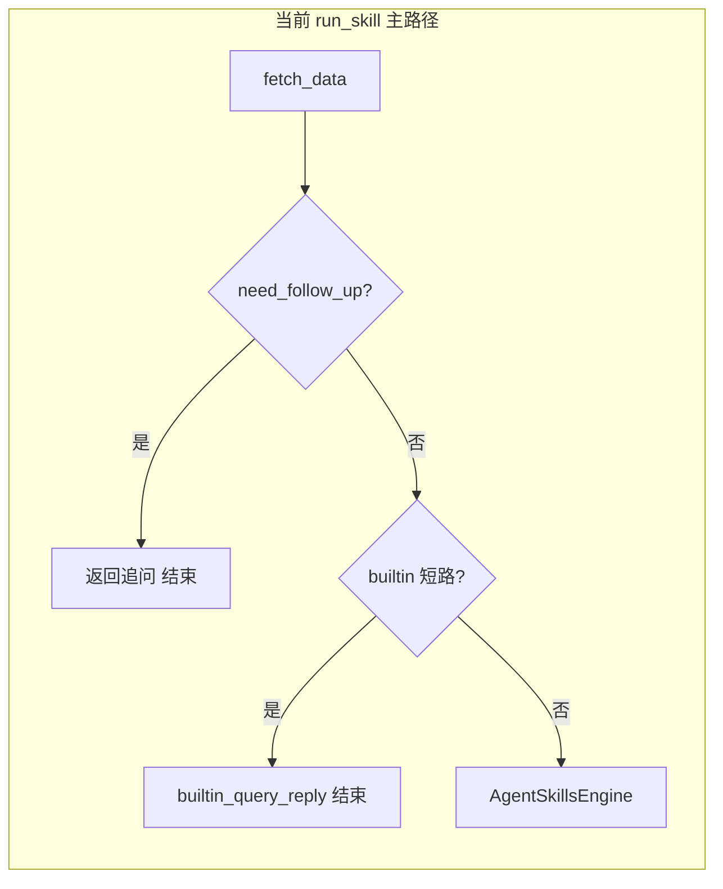
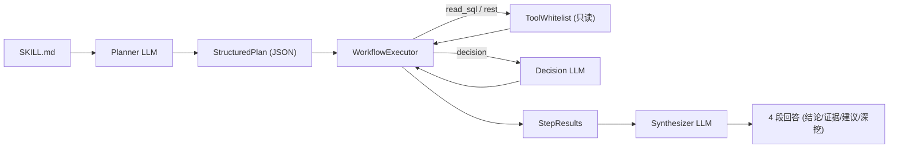

# Skill 即插即用与 `run_skill` 通用化改造

## 根因（与当前实现一致）

1. `**[src/service.py](src/service.py)` 中 `run_skill_with_llm` 在调用 Skill 引擎前短路**
  - `fetched.need_follow_up == True` 时直接返回追问，**从不进入** `[AgentSkillsEngine.process](src/skill_engine.py)`（约 229–245 行）。文档型 Skill（如 `[skills/oracle-enq-tm-contention/SKILL.md](skills/oracle-enq-tm-contention/SKILL.md)`）若 NL2SQL 无法生成可执行 SQL，会永远进不了 Skill。
  - `omr_db` 模式下，有 `latest_data` 且意图不是单目标诊断等时，走 `**builtin_query_reply`**（约 270–291 行），**未判断** MCP 传入的 `skill_name`。即使用户显式传 `skill_name=oracle-enq-tm-contention`，也会被表格回复短路。
  - 目标/监控项清单的 `builtin_query_reply`（约 247–268 行）同样在显式 `skill_name` 时未豁免。
2. `**[src/skill_engine.py](src/skill_engine.py)` 中 `SKILLS_DIR = Path("skills")` 相对当前工作目录**
  - MCP 从非仓库根目录启动时，`skills/` 可能不存在或为空，注册表为空 → 路由/强执均失败。
3. **注册表只在 `[AskOpsService.__init](src/service.py)__` 建一次**
  - 进程不重启则新拷贝的 `SKILL.md` 不可见（若 cwd 正确也如此）。
4. **辅助文档路径**
  - 注册表只加载 `references/` 下 `.md`/`.txt`；`oracle-enq-tm-contention` 若使用根目录 `reference.md`，当前不会并入 context（`[_load_references](src/skill_engine.py)`）。




---

## 目标行为（即插即用契约）


| 输入                                                   | 处理                                                                            | 输出                                                      |
| ---------------------------------------------------- | ----------------------------------------------------------------------------- | ------------------------------------------------------- |
| 仓库 `skills/` 下新增 `.../SKILL.md`（合法 frontmatter）      | 启动时或显式 reload 后出现在注册表                                                         | `health_check` / `list_skills` 可列出 `name`               |
| `run_skill(question=..., skill_name="...")` 且名称在注册表中 | **跳过** `builtin_query_reply`；若 `need_follow_up`，仍用最小 context 执行 SkillExecutor | `result` 为按 `SKILL.md` Workflow 生成的诊断；`skill_name` 为解析名 |
| `run_skill(question=...)` 不传 skill_name              | 保持现有取数 + 路由逻辑；但若会走 builtin，仍按上面规则仅在「未显式指定 skill」时短路                           | 与现网兼容                                                   |


**失败处理**：`skill_name` 显式传入但不在注册表 → 返回明确错误（不静默降级为 builtin）。LLM 未配置时保持现有降级文案。

---

## 实现要点

### 1. 稳定解析 `skills` 目录

- 在 `[src/skill_engine.py](src/skill_engine.py)`（或 `[src/metric_config.py](src/metric_config.py)`）中增加 **基于 `__file`__ 的默认目录**：例如 `Path(__file__).resolve().parent.parent / "skills"`，使从任意 cwd 启动 MCP 都能找到仓库内 skills。
- 可选：在 `[config/metric_map.yaml](config/metric_map.yaml)` 增加 `skills_dir`（或环境变量 `ASKOEM_SKILLS_DIR`）覆盖默认，便于部署时指向外部目录。

### 2. `run_skill_with_llm`：显式 `skill_name` 的「优先通道」

在 `[src/service.py](src/service.py)` 中抽取小函数 `_skill_name_in_registry(name) -> bool`，在 `**fetch_data` 成功返回后**尽早：

- 若 `skill_name` 非空且在注册表中：
  - **不要**因 `need_follow_up` 直接 return（改为：把 `follow_up_question` / NL2SQL 失败说明放进 `context` 的字段如 `fetch_notes`，`ok` 可与追问语义一致，但 **仍调用** `_skill_engine.process(..., forced_skill_name=...)`）。
  - **不要**进入两段 `builtin_query_reply`（目标/监控项清单与 omr 通用表格式）。
- 若 `skill_name` 非空且 **不在**注册表：返回结构化错误（`ok: False`, `result` 说明未加载的 name + 提示检查路径与进程重启）。

未传 `skill_name` 时保持现有分支顺序（仅去掉「显式 skill 时」不应触发的部分）。

### 3. 无 OEM 数据时的 Skill 执行

`[SkillExecutor.execute](src/skill_engine.py)` 在 context 空/不足时会走 `references`；需保证显式通道下 `context` 至少包含 `user_question` 相关字段（已有 `user_input`）。可在 `context` 中增加 `need_follow_up` / `follow_up_question`，便于 LLM 在 Skill 内说明「缺数据时按 SOP 给出步骤」。

### 4. 注册表可刷新（最小 MVP）

- 在 `AgentSkillsEngine` 上增加 `reload_registry()`：重新构造 `SkillRegistry` 并替换 `router`/`executor` 所依赖的 registry（或整引擎重建），由 `AskOpsService` 暴露方法。
- **二选一（实现成本由你方取舍）**：
  - **A**：扩展 `[health_check](src/mcp_server.py)` 返回 `skills: [{name, description}]` + `skills_dir` 解析路径，文档说明「更新 Skill 后重启 MCP」；
  - **B**：新增 MCP tool `list_skills` / `reload_skills`（只读 / 可写），便于运维验证即插即用。

### 5. Frontmatter 与参考文件

- 用已有依赖 **PyYAML** 解析 `---` 与 `---` 之间的 frontmatter（替代脆弱正则），要求字段仍为 `name`、`description`（与现有 SKILL 一致）。
- 扩展 `_load_references`：除 `references/` 外，可选加载同目录下 `reference.md` / `REFERENCE.md`（与现有 `[oracle-enq-tm-contention](skills/oracle-enq-tm-contention)` 布局对齐）。

### 6. 文档与 MCP 工具说明

- 更新 `[src/mcp_server.py](src/mcp_server.py)` 中 `run_skill` 的 docstring：**显式 `skill_name` 时强制执行该 Skill**，并说明 `skills` 目录配置与重启/刷新行为。

### 7. 测试

- 新增单元测试：模拟注册表含 `oracle-enq-tm-contention`，`run_skill_with_llm(..., skill_name=...)` 在 `need_follow_up=True` 或 `latest_data` 非空时 **仍会**调用 `process`（可用 mock `fetch_data` / `_skill_engine`）。
- 测试默认 `skills` 路径在 `skill_engine` 中解析为绝对路径（不依赖 cwd）。

---

## 风险与范围

- **不**在 MVP 内实现自动多步工具编排（仍是一次 LLM 调用 + 文档 Workflow）；符合仓库 AI Gateway 规则。
- 显式 `skill_name` 仍消耗 LLM token；若需省 token 可后续再按 frontmatter 分块。

---

## 简要实现计划（4 步，按顺序改即可）

目标：把 `SKILL.md` 扔进 `skills/<id>/` 就能被 `run_skill` 按文件里的 Workflow 执行。

1. **Skills 目录不依赖 cwd**
  - 位置：`[src/skill_engine.py](src/skill_engine.py)` 中 `SKILLS_DIR`
  - 改为：`Path(__file__).resolve().parent.parent / "skills"`，可用环境变量 `ASKOEM_SKILLS_DIR` 覆盖
  - 效果：MCP 从任意目录启动都能扫描到 `skills/*/SKILL.md`
2. `**run_skill` 显式 skill_name 走优先通道（最关键）**
  - 位置：`[src/service.py](src/service.py)` 的 `run_skill_with_llm`
  - 规则：`skill_name` 非空且在注册表中时
    - 跳过 `need_follow_up` 直接追问
    - 跳过两处 `builtin_query_reply` 短路
    - 一律调用 `_skill_engine.process(..., forced_skill_name=skill_name)`
    - 把 `follow_up_question` / NL2SQL 的说明放进 `context.fetch_notes`，供 SKILL.md 里的 Workflow 用
  - `skill_name` 不在注册表 → 返回结构化错误（不静默降级）
3. **暴露已加载 skills + 可刷新**
  - 在 `AgentSkillsEngine` 增加 `reload_registry()`
  - 在 `[src/mcp_server.py](src/mcp_server.py)` 新增只读 MCP 工具 `list_skills`（返回 `skills_dir` + `[{name, description}]`），方便验证「新 SKILL.md 是否加载」
4. **Frontmatter 与 reference 兼容**
  - 用 PyYAML 解析 `---...---` frontmatter（替代正则），仍要求 `name`、`description`
  - `_load_references` 除 `references/*.md|txt` 外，额外加载同目录下 `reference.md` / `REFERENCE.md`，匹配 `[skills/oracle-enq-tm-contention](skills/oracle-enq-tm-contention)` 布局

**验收（手动 1 条 + 自动 1 条）**

- 手动：拷贝 `[skills/oracle-enq-tm-contention/SKILL.md](skills/oracle-enq-tm-contention/SKILL.md)` 后重启 MCP，`list_skills` 能看到；调用 `run_skill(question="...", skill_name="oracle-enq-tm-contention")` 返回的回答沿用该文件的「应急处理步骤」章节结构
- 自动：pytest mock `fetch_data` 返回 `need_follow_up=True`，断言 `run_skill_with_llm(..., skill_name="oracle-enq-tm-contention")` 仍调用 `_skill_engine.process`

---

## 最终方案：Workflow 引擎 + auto_extract（取代上文单次 LLM 方案）

目标：`run_skill(skill_name=...)` 真正按 `SKILL.md` 的步骤**逐步执行**，步骤之间遵守依赖与条件分支；作者**不需要**额外写 `workflow.yaml`，LLM 从 markdown 自动抽步。

### 执行流程




### 三个子组件

1. **Planner（LLM，一次）**
  - 输入：`SKILL.md` 全文 + `user_question` + `context`（OEM 数据 / fetch_notes）
  - 输出：`plan` JSON，节点 schema：`{id, title, type, content, depends_on[], condition}`
  - `type ∈ {read_sql, rest_call, decision, write_command, info}`
  - SKILL.md 里

```sql

``` 代码块默认 `read_sql`；含 `alter system kill` / `drop` / `update` / `delete` / `insert` / `truncate` 等关键字的一律改判为 `write_command`

2. **Executor（纯代码）**
   - 按 `depends_on` 拓扑顺序执行，直到 `stop` 或达到 `max_steps`
   - **SQL 执行统一走 MCP `execute_omr_sql`**：仅允许 `SELECT` / `EXPLAIN` 单语句；多语句、写语句直接拒绝执行
   - `read_sql` 步骤执行后，把 `execute_omr_sql` 返回结果写入 `StepResult`，再驱动后续 `decision` / `read_sql` / `info` 步骤
   - **写步骤**：**不执行**，原文 SQL / 命令原样收集到「下一步建议」
   - **decision 节点**：一次小 LLM 调用（system prompt = 该 step 的 `condition` + 上游 `StepResult`）→ 返回 `next_step_id` 或 `stop`
   - 安全阀：`max_steps=8`、单步超时 30s、同一 step 不得重入

3. **Synthesizer（LLM，一次）**
   - 输入：`SKILL.md` + 所有 `StepResult` + 未执行的 `write_command`
   - 输出固定 4 段（符合仓库规则 §5）：
     1. 结论
     2. 证据（每个已执行 step 的 SQL / 返回摘要）
     3. 下一步建议（write_command 原文，至多 3 条）
     4. 深挖入口（SKILL.md 引用 / OEM / Grafana 链接）

### 关键文件改动

- `[src/skill_engine.py](src/skill_engine.py)`：新增 `WorkflowPlanner`、`WorkflowExecutor`、`StepResult`、`Synthesizer`
- 新增 `[src/workflow_tools.py](src/workflow_tools.py)`：只读工具白名单注册（`execute_omr_sql` / `fetch_data_from_oem` / `run_health_check`）
- `[src/service.py](src/service.py)` `run_skill_with_llm`：显式 `skill_name` → **默认走 workflow 模式**；未命中注册表 → 报错（不降级）
- `[src/mcp_server.py](src/mcp_server.py)`：新增 `list_skills` 工具；`run_skill` docstring 写明「逐步执行、只读白名单、写操作仅作为建议」
- 目录解析：`SKILLS_DIR = Path(__file__).resolve().parent.parent / "skills"`，env `ASKOEM_SKILLS_DIR` 可覆盖

### 合规（严格遵守 AI Gateway MVP 规则）

- 第一阶段**只读**：write_command 一律不执行，仅作为文本建议
- 仅通过 REST 与 MCP 工具 `execute_omr_sql`（只读）接触 OEM；禁止直连 repository
- 缺参数时 Planner 在输出里**直接**给「追问」节点，不猜测补全

### 用 `[skills/oracle-enq-tm-contention/SKILL.md](skills/oracle-enq-tm-contention/SKILL.md)` 做验收样本

- Planner 至少抽出：查询A（read_sql）、查询B（read_sql）、kill session（write_command）、信息采集（info / read_sql）
- Executor 实际执行查询 A、B；kill session 不执行，进入「下一步建议」
- Synthesizer 根据真实返回行判定 Blocker 会话并给出精确 `alter system kill session '<sid>,<serial#>,@<inst>'` 建议

### 实施顺序（todos）

1. `skills_dir` 基于 `__file`__ + `list_skills` 工具（最小可见性）
2. Planner：SKILL.md → plan JSON（含 read / write 自动分类与 SQL 安全判定）
3. 只读 ToolWhitelist + Executor（`execute_omr_sql` 循环执行、顺序推进、超时与步数上限）
4. decision 节点 + 分支跳转
5. Synthesizer 4 段输出整合；`run_skill_with_llm` 显式 skill 走 workflow 模式
6. `enq: TM` e2e 回归 + pytest 断言（mock omr_client 返回行）
7. 文档：`run_skill` docstring + README「如何新增 Skill」短文
```

